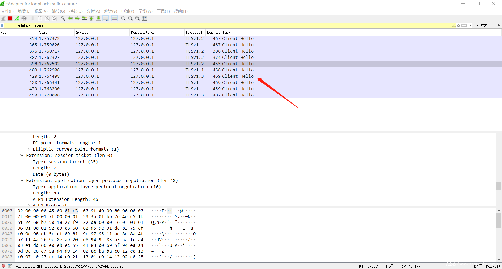
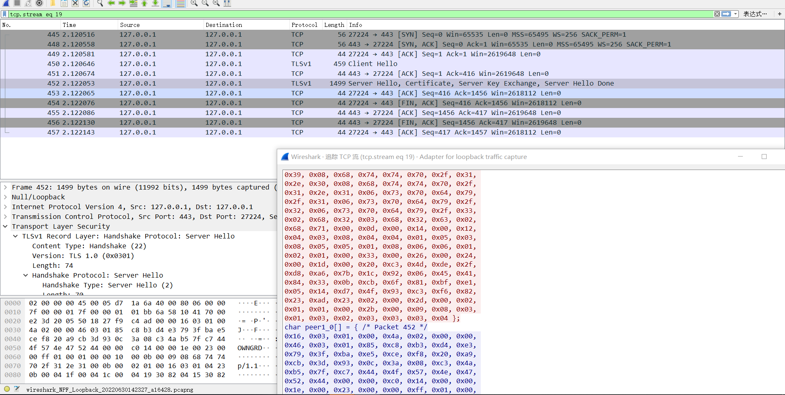
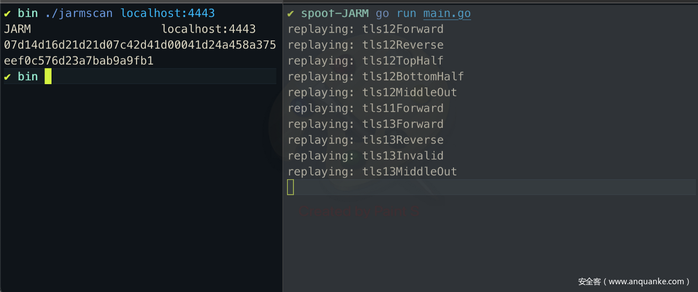
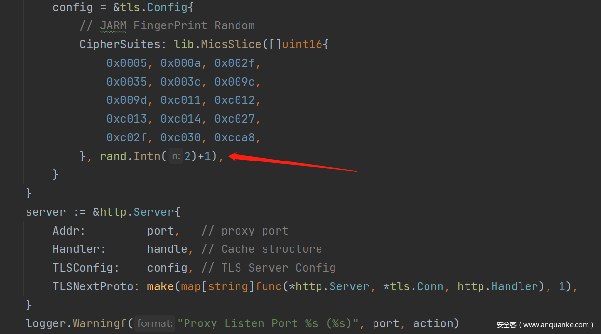
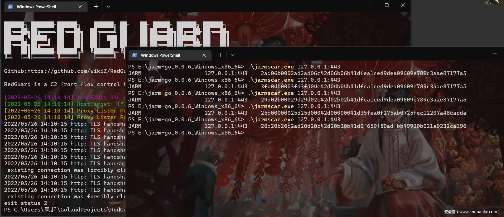

# JARM指纹混淆随机化

作者：风起

## 基于JARM指纹的C2识别

 JARM的工作原理是主动向目标TLS服务器发送10个特殊构造的TLS Client Hello包，以在TLS服务器中提取独特的响应，并捕获TLS Server Hello响应的特定属性，然后以特定的方式对聚合的TLS服务器响应进行散列，产生JARM指纹。

因为Client Hello中的参数不同，最终返回的Server Hello都是不相同的，通过发送特殊构造的Client Hello握手包，以获取与之对应的特殊Server Hello响应，以此作为依据，最终产生TLS Server指纹。

JARM以不同的顺序发送不同的TLS版本、密码和扩展，以收集唯一的响应。

- 服务器是否支持TLS 1.3协议?
- 它会用1.2密码协商TLS 1.3吗?
- 如果我们将密码从弱到强排序，它会选择哪个密码?

这些是JARM本质上要求服务器提取最独特响应的异常问题类型。然后对这10个响应进行哈希处理以产生JARM指纹。

TLS Client Hello请求流量

Wireshark Filter:

```
ssl.handshake.type == 1
```



TLS Server Hello响应



多数情况下JARM指纹都是用以佐证TLS服务并进行标记，从而关联服务。当然，最理想的状态下，我们能够通过JARM指纹唯一的指向目标C2设施，但是实际来讲JARM指纹对于不同服务器部署的C2设施并不是唯一的，有很多因素都会对其扫描的结果造成影响。所以我们并不能作为行为测绘的指纹直接关联到某个C2的服务，仅能起到佐证的效果。

在开发RedGuard的过程中我发现，因为本身来讲RG的作用就是进行前置流量的控制，从而实现后端C2服务的隐匿性，在蓝队对流量交互进行分析的时候，针对RG的JARM指纹扫描结果在多数差异的环境下都是相同的，也就是说，在分析的过程中，这个指纹是可以起到佐证攻击设施的作用，从而破坏我们想要预期达到的隐匿性。

基础设施的更改（例如，IP 地址、托管平台）不会影响JARM签名，这使得常规的方式难以对其进行规避。

影响服务端JARM指纹的因素：

- 操作系统及版本
- 使用的库及版本
- 调用库的顺序
- 自定义配置
- ……..

也就是说，如果我们想要影响最终针对服务端的JARM指纹扫描结果，我们就要从上面的几个因素入手去做，目前的解决方案共有两种：

一、重播TLS Server Hello响应

二、更改TLS Server配置CipherSuites加密套件

第一种方式也就是在监听特定客户端 Hello 的 TCP 服务器，然后在C2服务器上捕获这些特定的Client Hello（每个请求都有重复的字节，使用这些字节来识别每个特定的Client Hello握手包）,稳定的对这10个特殊构造的Client Hello的响应进行重播，从而实现改变真实JARM指纹的效果。

```
if bytes.Contains(request, [] byte { 
     0x00, 0x8c, 0x1a, 0x1a, 0x00, 0x16, 0x00, 0x33, 0x00, 
     0x67, 0xc0, 0x9e, 0xc0, 0xa2, 0x00, 0x9e, 0x00, 0x39 
     , 0x , 0xc0, 0x9f, 0xc0, 0xa3, 0x00, 0x9f, 0x00, 
     0x45, 0x00, 0xbe, 0x00, 0x88, 0x00, 0xc4, 0x00, 0x9a, 
     ... ... 
}) { 
     fmt.Println("replaying: tls12Forward ") 
     conn.Write([] byte { 
         0x16, 0x03, 0x03, 0x00, 0x5a, 0x02, 0x00, 0x00, 
         0x56, 0x03, 0x03, 0x17, 0xa6, 0xa3, 0x84, 0x80, 
         0x0b, 3,d, 0xbb, 0x 0xe9, 0x3e, 0x92, 0x65, 
         0x9a, 0x68, 0x7d, 0x70, 0xda, 0x00, 0xe9, 0x7c, 
         ... ... 
     }) 
}
```

在对所有十个不同的请求实施回复后，可以伪造完整的签名。



 这是一种比较懒惰的办法了，最终的效果确实能够对JARM扫描的结果进行混淆，但是我认为太过单调，需要注意的是ServerHello的原始响应他不能进行任意修改，因为在工具开发中流量的正常交互才是最重要的，任意修改上述一些影响 JARM扫描的因素可能导致无法正常通信的问题出现。也就是说他所重播的这些ServerHello数据包是需要监听某个正常的服务的JARM扫描响应来实现的，并不适合我们应用到工具去实现混淆的效果，我们需要一种简单而又稳定的方法。

当然，这种方式还有一种延伸，就是首先随机获取正常站点的列表进行JARM指纹扫描，从而获取其ServerHello响应然后，直接作为识别到JARM扫描握手包的响应包进行重播，这样是最合理的一种方式。

 第二种也就是阿姆斯特丹2021 HITB议题《COMMSEC: JARM Randomizer: Evading JARM Fingerprinting》中提到的一种方式，作者在github上对衍生工具 JARM Randomizer进行了部分开源，通过阅读它的代码不难看出，其实与我最初想到的方式非常相像，最终影响JARM的因素使用的是CipherSuites加密套件（加密算法套件 CipherSuite 由各类基础加密算法组成）**

实现代码：



如上图，针对反向代理的TLS Config CipherSuites的设置，我提供了15种不同的加密套件方式，1/2/3….个不同组合的加密套件最终得到的JARM指纹结果都不是相同的(加密套件过多会导致无法正常通信的玄学问题)，这里我对这15种加密套件进行随机组合的方式，1-2个随机取值进行组合这些CipherSuites，大概会有几十种不同的随机JARM指纹产生。

最终效果如下：



可以看到，最终应用在工具的效果就是在每次启动RG的时候，它的JARM指纹都不是相同的，会自动根据上述的混淆方式产生一个全新的JARM指纹，可以防止空间测绘的扫描，以此关联公网上RG基础设施的部署情况。目前市面上多数测绘平台都会进行集成并默认进行JARM指纹的扫描，可能也是因为其扫描效率快，扫描资源成本低、同时又对C2设施有着一定的佐证指向性的原因吧。

RedGuard是一款C2基础设施前置流量控制设施，可以规避Blue Teams、AVs、EDRs检查。

## 参考链接：

https://github.com/wikiZ/RedGuard

https://github.com/netskopeoss/jarm_randomizer

https://grimminck.medium.com/spoofing-jarm-signatures-i-am-the-cobalt-strike-server-now-a27bd549fc6b

https://conference.hitb.org/hitbsecconf2021ams/sessions/commsec-jarm-randomizer-evading-jarm-fingerprinting/
