# 前记

​	大家好，我是风起，本次给大家分享的是 **Serverless扫描技术** 也是我在SecTime沙龙演讲时讲到的一种隐匿扫描技术，通过 **Serverless（云函数）** 实现各种扫描器探测功能，以达到绕过态势感知、WAF等安全设备，增大蓝队研判人员溯源难度，实现封无可封，查无可查的效果。希望大家通过阅读本文能够有所收获，那么下面由我来给大家揭秘这个有趣的攻击方式吧。

# Serverless目录扫描实现

​	首先创建一个云函数，这里以腾讯云举例。

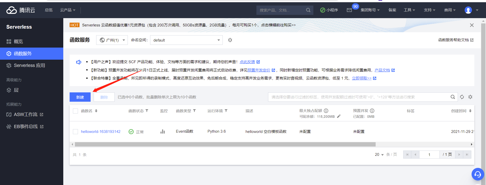

​	然后选择自定义创建，运行环境选择python3.6，函数名随意，地域则随便选一个即可，会随机分配该地域下的IP作为我们的出口IP地址，配置与云函数上线CS的方式相同。

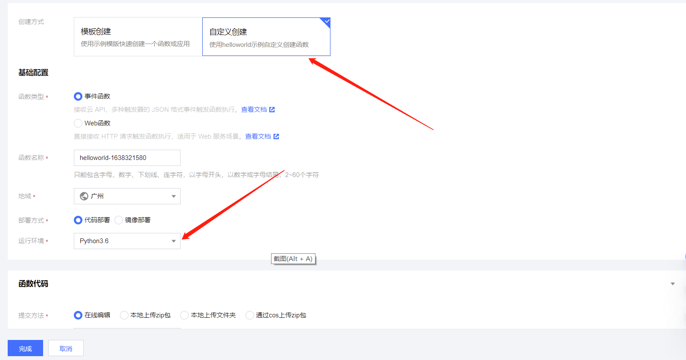

​	云函数代码为以下，无论是云函数还是域前置或者反向代理等手段，本质都是流量转发，所以我们在云函数上编写的核心代码就是实现了单次扫描返回信息的功能，剩下的控制代码则由我们本地编写的代码执行。

```python
# -*- coding: utf8 -*-
import requests

def main_handler(event, context):
    headers=event["headers"]
    url=event["queryString"]["url"]
    path = event["queryString"]["path"]
    crake_url=str(url+path)
    try:
        r = requests.get(crake_url,timeout=5,headers=headers,verify=False)
        status = r.status_code
    except Exception:
        status = None
        pass

    return status,crake_url
```

​	配置好云函数代码后，继续进入 **触发管理** 选项。

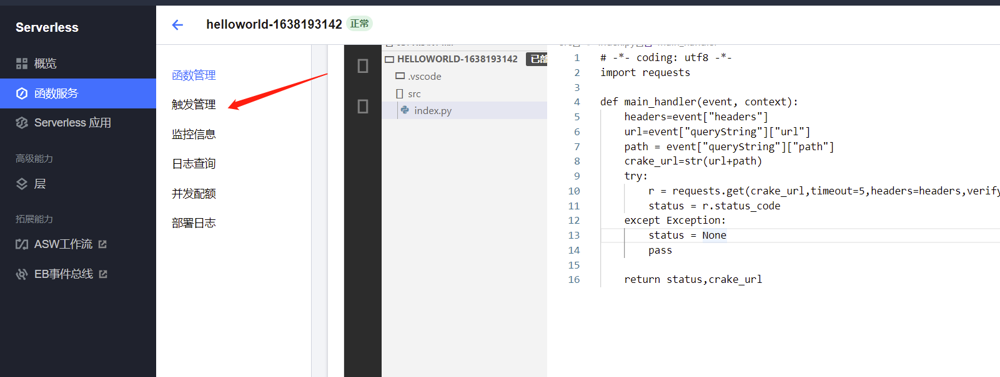

​	触发器配置如图所示，注意取消勾选集成响应。


​	编辑API配置中，将路径设置为 **/** ，然后点击 **立即完成**

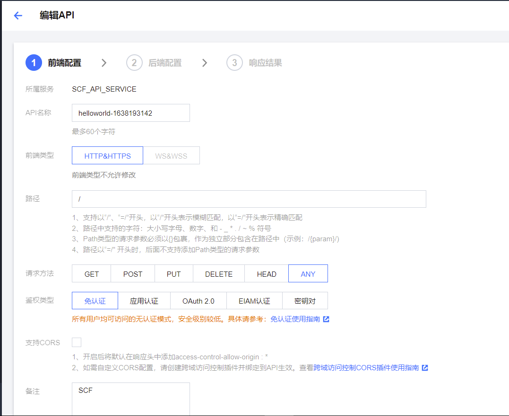

​	然后得到了两个API网关的公网域名，这时我们就已经完成了基本配置。可以通过这两个公网域名实现对我们上面编写的云函数功能的触发实现。

​	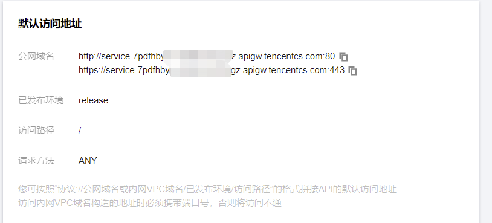

​	这里进一步编写一个简单的Demo，在本地实现了一个目录扫描的功能，通过对获取的公网地址传参，实现以云函数服务对指定站点目录扫描，这里我传递了要扫描的url地址以及字典，代码如下：

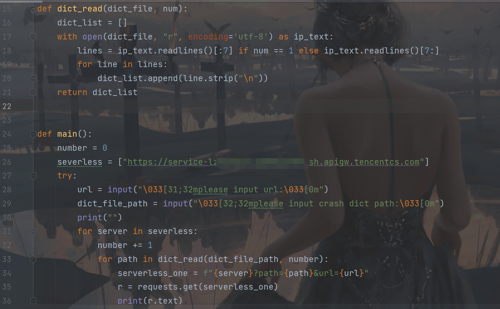

​	在我们本地执行代码进行扫描，会得到响应给我们并输出扫描结果。

​	

​	通过微步情报可以发现确为，腾讯云—广州的IDC服务器

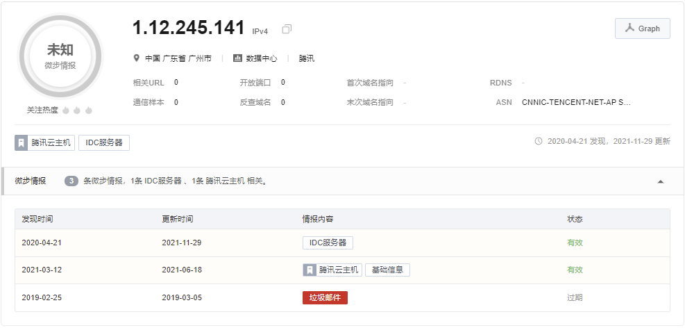

​	但是大家注意看 **Apache access.log日志中** header头中的User-Agent为python-requests/2.26.0，存在了很明显的特征，这时我们继续修改本地控制代码。

​	

​	我们创建一个 get_ua-header.py文件，其中创建了一个UA数组，存放了大量不同的User-Agent。


​	这里导入我们刚才创建的UA数组，然后在第二个箭头所指处设置header的User-Agent每次都随机获取UA数组中的值，再在发送请求中指定header，当然这里仅为了演示，如果真实场景下，可以将header头自定义设置更多选项让它看起来更像是一个合法的请求。

​	

​	这里云函数中获取到了我们本地请求API网关域名的headers然后在转发时将它的header替换为我们本地请求包中的header从而实现了自定义header的效果，修改后的扫描情形如下图所示：

​	

​	发现在Apache日志中，User-Agent已经为我们本地请求的随机信息，那么通过继续自定义本地控制代码中的header信息让他看起来更加合理，就可以实现更加隐匿的扫描啦。

​	继续我们重复上面的操作，创建一个一模一样的云函数，API网关也为相同配置，但是需要注意的是选择的地域要为不同的地方，因为 **单个用户在某个地域只能有5个随机出口IP**，也就是说如果这五个IP均被封禁了那么我们的扫描就无法继续进行了，但是攻防本身就是对等的，那么有什么办法能够绕过呢？

​	我们增加了两个一模一样的云函数配置，仅为选择的地域不同，也是为了绕过上面这一限制，修改我们的代码添加另一个API网关域名地址对字典进行分工扫描，两个云函数分别截取字典的部分内容进行扫描，这里我选择的地域是广州和上海，然后开始目录扫描。

​	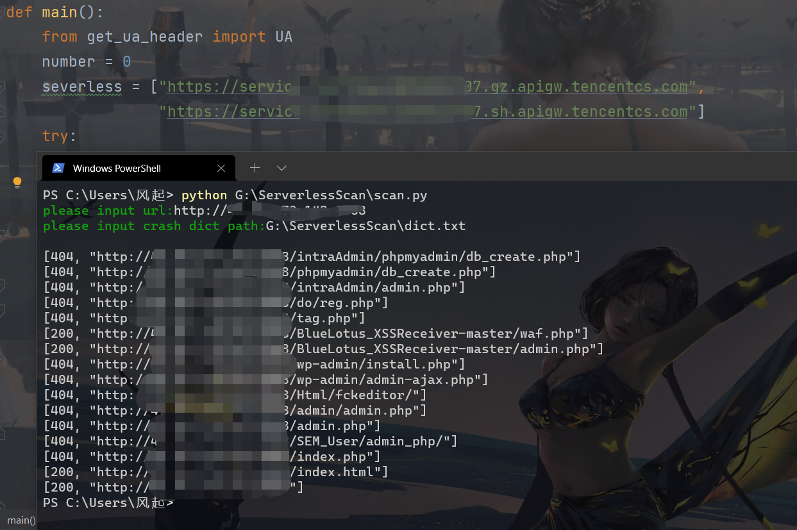

​	现在继续查看access.log日志，发现多出了一些上海的IP地址，是不是更加迷惑了呢？而在目标业务系统中每天面对大量的请求使用中，以往的排查溯源思路都是过滤频繁访问或者进行可疑操作的IP地址，但是对于这种情况，通常会被一些正常的请求混杂其中，防守方进行日志审计时往往就会认为这些是正常的HTTP请求。


​	关于这里分批扫描的实现思路在 **拓展延伸** 会继续深入讲解。

# Serverless端口扫描实现

​	然后我们继续来实现端口扫描器的实现，云函数的配置及API网关配置这里就不多做赘述了，与上面讲到的一样，这里我们仅关注云函数代码和本地控制代码的实现。

​	云函数代码如下：

```python
# -*- coding: utf8 -*-
from socket import *

def main_handler(event, context):
	IP=event["queryString"]["ip"]
	port=event["queryString"]["port"]
	try:
		conn=socket(AF_INET,SOCK_STREAM)
		res=conn.connect_ex((str(IP),int(port)))
		conn.send('Hello,World!'.encode("utf8"))
		results=conn.recv(25)
		if res==0:
			conn.close()
			return port
	except Exception as err:
		print(err)
	finally:
		print("")
		conn.close()
	
	return None
```

​	同样这里云函数仅需要实现简单的单次端口扫描，我们的控制代码如下：

​	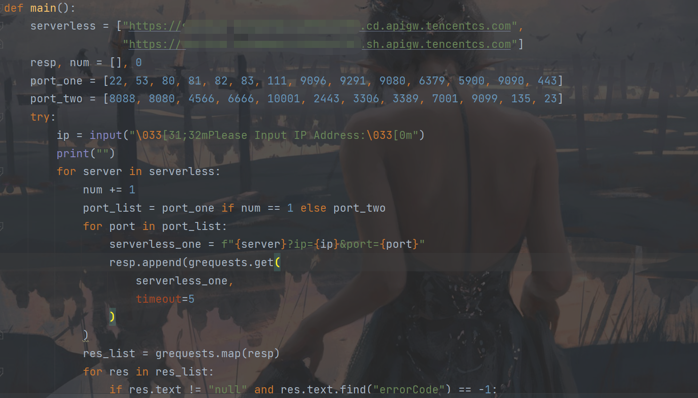

​	可以看到，这里同样应用了上面的讲到的分批扫描，如果说上面讲到的是通过对字典中的路径区分使用两个不同的云函数API网关域名，那么这里的端口扫描则为通过端口来区分。

​	因为端口扫描会慢一些，所以这里我使用了协程的方式，扫描速度会更快，使用了grequests模块。

​	这里执行一下本地扫描脚本，成功的得到了目标主机端口的开放情况，但这不是重点。

​	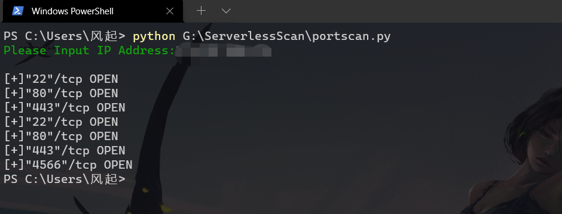

​	这里使用Hfish来展示态势感知中的端口扫描情况

​	

​	可以看到，对这些端口扫描的IP均为腾讯云的随机IP，是不是无从下手呢？

​	

​	通过Kunyu对这些IP进行批量查询发现，发现所在地均为中国上海和成都两地，也证实了攻击IP为我们云函数的出口IP地址，并且这些数据的Time时间均比较早，而在威胁情报中看到这些IP为IDC服务器，也辅助说明了这些IP为已经回收目前应用于云函数进行请求的云服务器的IP地址，这里的时间因素也是我们后续判断溯源这种攻击方式的关键所在。

​	

​	欢迎大家来了解一下Kunyu，是一个很好用的空间测绘数据分析工具，其中亮点满满哦~ 非常适合大家在红蓝对抗的工作中进行信息收集或者溯源等工作，不同于其他工具的是，Kunyu的设计更贴合数据分析的工作而不仅仅只是IP导出。

**下载地址：https://github.com/knownsec/Kunyu**

# 拓展延伸

​	上面讲到了 **单个用户在某个地域只能有5个随机出口IP** 那么在更大流量的扫描下，单次如果仅仅只是5个扫描的IP地址，依旧非常容易被排查出来从而封禁IP。那么为了解决这一问题，我们可以通过分批次的方式进行扫描，如果是端口扫描，我们就可以创建多个云函数且为不同地域分工扫描不同端口，在态势感知来看就是这n*5个IP地址在进行扫描，也就解决了单个地域只能有5个IP的窘境。

​	同样进一步思考，我们也可以在相同的云函数下创建多个地域的云函数，再创建其他厂商的云函数，实现了IP地址的多元化，在这个基础上再创建不同地域，理论上可以这样一直叠加，实现单兵大流量扫描。

​	对于大集团目标，通常每天态势感知都会有很大的扫描流量，那么在这种情况下，如果给我们的云函数扫描再加上一定程度的随机延时扫描，那么在态势列表中看到的就是一堆不连续的单次请求，如果是目录扫描则会直接认为是正常的请求，因为IP的随机性以及请求包的合法性、不连续性根本无法联想这是一次扫描事件，更不要谈溯源的问题了，根本无法还原攻击链，这样的攻击只会比C2隐匿反弹更难缠。

​	整个实现过程思维导图如下：

​	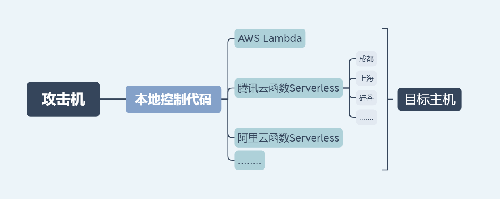

​	各位小伙伴也可以在我所讲的基础上，更进一步将请求包完善的尽量合理化，这样面对防火墙等设备，面对大量的IP扫描也无法通过IP频繁请求的方式从而封禁IP，导致封无可封，更别谈溯源的问题了。而本地的控制代码可以帮助我们更好的对整个扫描进行控制处理，让整个扫描更加个性化，云函数代码只进行单次流量转发扫描，而本地代码则负责了通过什么样的方式扫描的问题。

​	但是面向蓝队成员来讲也不需要太过恐慌，毕竟有攻就有防，针对这种扫描，如果找出可疑流量直接封禁IP即可，这种情况下就会导致红队扫描结果的不准确，某个IP被封禁了，那么他的后续通过这个IP的请求都将扫描失败。

​	再退到红队的角度，面对上面的应对方式，我们可以通过思维导图中讲到的分工扫描，多个云函数交替重复相同的扫描任务防止封禁，这样某个IP被封禁也不用怕扫描的失效，当然一般来讲封禁IP也都是扫描结束后的事情了，通常防守方根本没那么快的响应速度。

​	我一直认为攻防对抗双方是对等的立场，各自都有自己的优势，而如何利用自身的这种优势实现目标就是需要思考的问题了，在检验企业安全的同时也在磨练技术人员的技术水平，这也是红蓝对抗的意义所在。所以大家在思考攻击或者防守问题时一定要站在对立的角度去想，思考对方的应对手段才能找到问题的突破点。

​	上面提到的代码均已上传至Github，感兴趣的师傅可以自行下载，也可以自己编写。

​	**下载地址：https://github.com/wikiZ/ServerlessScan**

# 后记

​	回忆一下2021年11月份，我平均每周都会进行一次演讲活动，或为团队分享、内部分享、沙龙分享，也很感谢各位小伙伴的支持。我觉得在这种分享的场景下，是非常提升交流沟通能力的。在与运营小姐姐的对接，预演等工作以及准备PPT，构思怎么去把自己所学的更好的讲出来，能够让别人接受，这些都是以往我没有去想过做过的事情，我觉得人也正是在每一次这种经历下不断成长起来的，我也深知自己能力不足，所以始终不敢懈怠。

​	时至今日，Kunyu有了很多Title，补天白帽大会年度最佳兵器奖，404星链计划，Kcon兵器谱等，也很感谢大家的支持，我也没有想到当初无心去做的一件事情能够得到那么多人的支持，我也会坚持更新听取大家的需求，去更好的完善Kunyu，看到国内的师傅们甚至国外的从业者的关注我觉得真的是一件非常有成就感的事情。

​	至于风起这一ID，最初的取义是来自 **风起于青萍之末** 作为灵感。因为我也并非科班出身，所以ID的取义也是希望自己能够在不断的积累中逐渐壮大，真正的大风起兮，当然距离这一目标还有非常远的路要走哈哈哈。 

​	回想一下2021年，我共输出了8篇文章，这个数量其实是不多的，但是我始终坚持输出我认为有用的知识点，哪怕几个月输出一篇，我也坚持不去制造一些重复性的工作，每篇文章都会带入自己的一些想法给大家。我觉得如果写文章变成了为了写文章而去写那么就失去了它的意义所在，所以我一直坚持在安全文章平台去写，看到一些公众号付费的文章也只能付诸一笑，我赞同知识付费，但是就我个人而言，能够让更多的人看到我的文章有所收获了解到风起，远比利益本身重要得多，所以我也会继续坚持这一理念，坚持输出，继续进步。

​	也许因为这是本年度最后一篇文章，所以在后记讲的多了一些，也希望大家理解，在这里感谢大家在这一年度对我的支持，祝大家心想事成，美梦成真。

​	想要交流涉网案件、红队攻防技术的师傅可以联系我，平常我也非常喜欢交朋友。

​	
