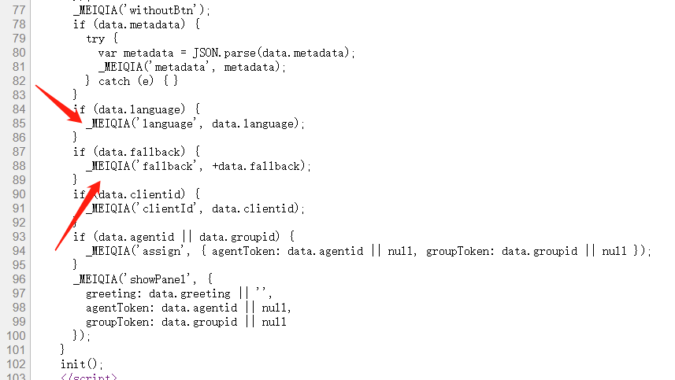
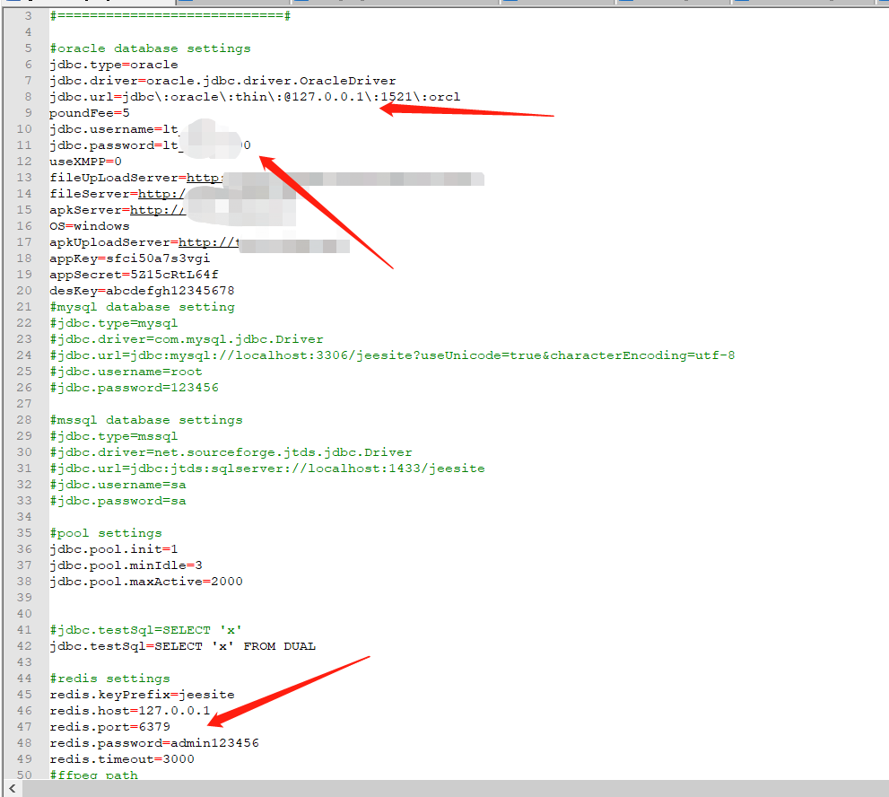
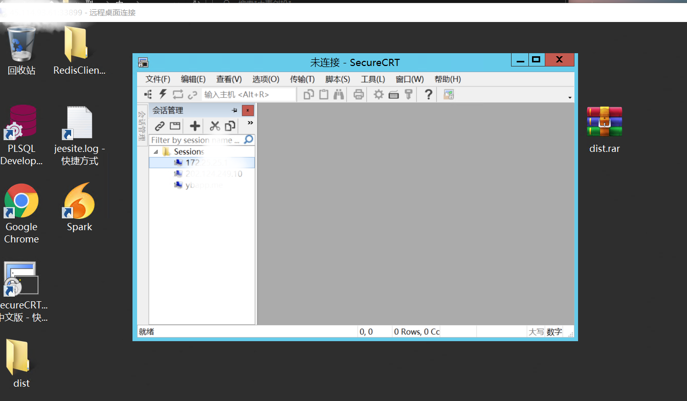
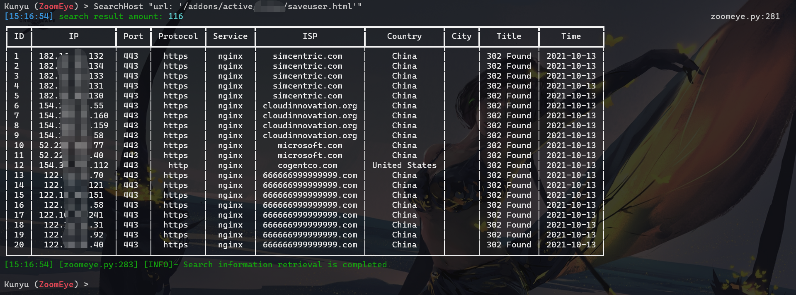
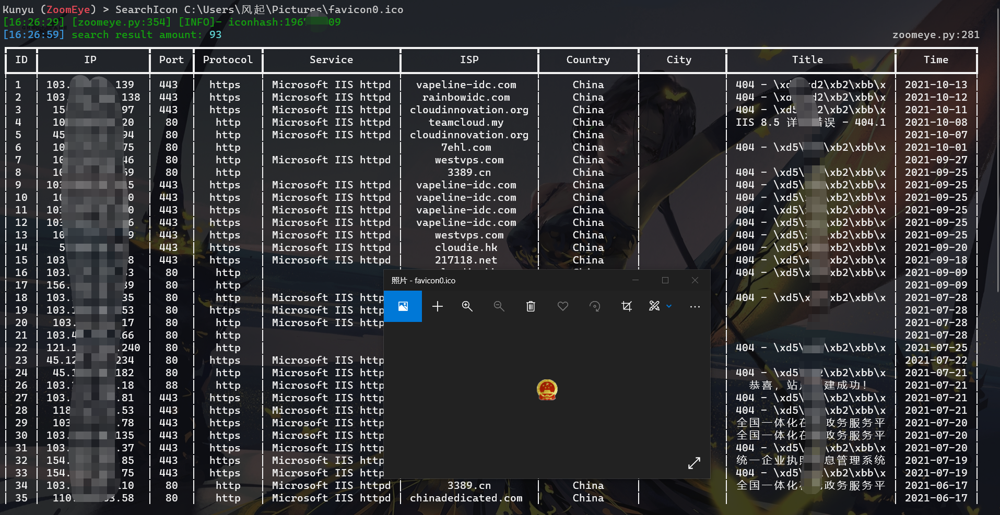
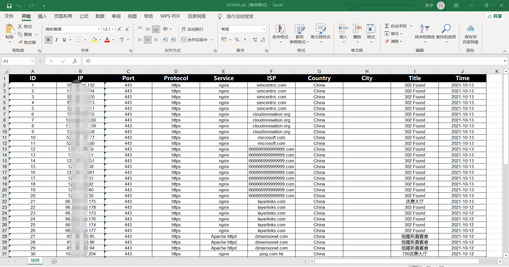
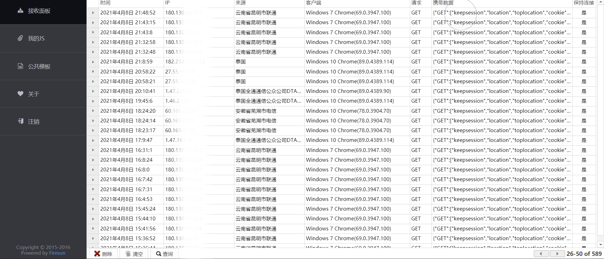
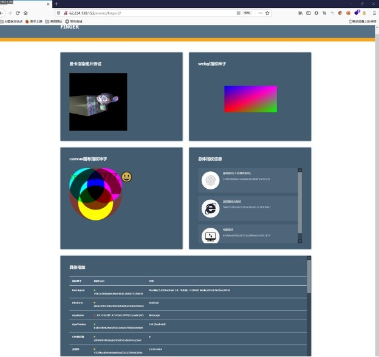
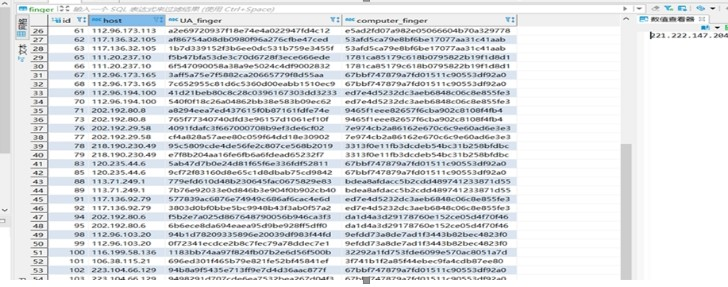

# 新型网络犯罪攻防技术研究

作者：风起

# 前言

​	大家好，我是风起。本次带来的是对于新型网络犯罪的渗透研究，区别于常规的渗透测试任务，针对该类站点主要核心不在于找出尽可能多的安全隐患，更多的聚焦于 **数据** 这个概念。值得注意的是，这里的数据更多时候指的是：**代理身份**、**后台管理员身份**、**受害人信息**、**后台数据**、 **消费凭证** 等信息。总的来说，一切的数据提取都是为了更好的落实团伙人员的身份信息。

​	所以无论是获取权限后的水坑钓鱼还是拿到数据库权限后提取信息亦或者提取镜像数据的操作都是在这个基础之上的。本文将以深入浅出的方式对渗透该类犯罪站点时的一些注意事项作出讲解，希望能够对注焦于此的安全人员有所帮助。

​	**本文仅作安全研究，切勿违法乱纪**。

# 攻击初识

​	以下即为一个常见的博彩类站点，首先我们可以对该类站点的功能进行盘点。

​	首先从在线客服这里来讲，一般来讲博彩诈骗类站点都使用 **美洽客服系统** 较多，也因为其安全、部署便捷的缘故而被广大该类站点开发者所使用。目前来讲，针对该客服系统感觉并没有什么漏洞，所以通常使用钓鱼的方式来突破客服口，而常常对于有一定规模的团伙，他们的 **客服跟财务** 通常是同一业务团队，所以在以往的渗透中发现，在其客服机上常常存在大量的受害人信息及下级代理信息，这里大家可以重点注意一下，以钓鱼的方式突破客服口往往有意想不到的收获，毕竟无论在哪里 **人永远是最大的漏洞**。

​	对该类站点渗透经验丰富的师傅，可以通过客服样式直接判断，当然也可以通过前端代码匹配关键字进行更为精准的判断目标客服系统。

​	往往该类博彩站点都是以移动端APP作为主要方式使用，所以在快速渗透的过程中我们可以优先反编译审计一下目标APP中是否存在一些敏感信息，例如提取URL拓宽战线、获取AK/SK控制云服务器。往往在提取APP中敏感信息会有意外之喜，下图为一次渗透目标中提取到的一些敏感信息。

​	网上有不少敏感信息自动提取的工具，这里我用的比较多的是 **ApkAnalyser** ，当然GA部门也有专门的设备用于提取，工作性质不同所能利用的资源也不尽相同。

​	对于一些代码能力较强的师傅，也可以直接通过反编译APK包审计代码，寻找敏感信息，当然这里建立在APP没有加壳等防护手段的基础上。

​	通常，对于需要重点注意的关键词如：**Password**、**id**、**accessKeyId**、**Username**、**accessKeySecret**、**mysql**、**redis**等等，这里根据攻击者对于 **敏感性** 概念的认知做提取操作。

​	如上图，为一次渗透目标中，通过APP反编译得知目标AK/SK凭证，并且得知OSS服务为aliyun厂商，地域香港。于是直接获取到OSS服务权限，并且通过阿里云API命令执行上线C2。当然，OSS对象存储也是我们需要注意的一个点，通常为了方便起见，会将受害人的信息上传到OSS服务。

​	具体通过AK/SK对阿里云服务器进行命令操作的方式不再赘述，感兴趣的小伙伴可以自行查看下面链接使用。

Aliyun API: https://api.aliyun.com/#/?product=Ecs&version=2014-05-26&api=RunCommand&tab=DEMO&lang=JAVA

## 记一次有趣的渗透过程

​	整个攻击过程大概如上图，简单的画了一下思维导图。

​	该案例也是较大规模一个博彩目标，通过前期的信息收集及渗透工作，对博彩站点的主站并没有拿下什么成果，但是在对客服系统的测试中，通过与其客服人员交流得知该博彩平台玩家均使用内部自研的聊天工具沟通（也是为了躲避GA部门的取证方式）。于是我们将战线转至该聊天系统，在聊天系统下载页发现目标使用了Apche Shiro框架，于是很顺利的打了一波顺利拿下权限，但是该主机为tomcatuser权限较低，且发现没有其他的服务，仅提供下载作用，总之并没有特别的收获，于是继续拓宽战线。

​	这里根据对目标页面的Title作为特征，快速提取了52条结果，并且经过存活性验证及渗透，共拿下20余台主机权限，当然有一个很有趣的小Tips，就是这些站点并不是一成不变的，有的页面在默认页不存在Shiro，但是访问特定的登录页面下就出现Shiro框架了，这也跟shiro配置路由原因有关。

​	在拿下的多台服务器后，打扫战场成果的时候，我们发现有几台服务器的权限为root。使用fscan对内网快速扫描了一下，发现内网IP中开放了不少mysql，redis，oracle等服务。该内网中使用大量的反向代理，有不少公网IP在拿下权限后指向的却是相同的内网服务器。其中，居然还部署了JumpServer堡垒机，不得不说，这个目标确实有点东西，通常堡垒机也是为了集中管理服务器准备的。但是很遗憾，通过之前爆出的JumpServer RCE漏洞并没有利用成功。

​	继续对这些服务器上配置文件的审计，我们找到了通往Mysql/redis数据库的密码。

​	这里通过密码复用，对内网中使用redis数据库的主机进行写入SSH KEY的方式获取权限，且均为root权限。继续使用获取到的mysql密码，顺利登录多台内网数据库，因为我是用冰蝎管理webshell权限的，所以使用的是它的数据库管理功能测试连通性的。这里我们需要把端口代理出去，其实这里没有什么难度，因为其内部防火墙规则对于一些端口进行了限制，所以我们仅能通过80等端口入网。这里我使用的是Neo-Regeorg正向代理的HTTP流量。但是速度有些慢，后面使用NPS监听端口为80同样可以。

​	通过对数据库中进行取证，发现了主站客服系统、后台管理系统的登录密码，这里包括了该组织运营的其他博彩站点后台管理，这也算是意外之喜了。

​	

​	而在线上取证基本完成的时候，本着仔细的态度，我又一次对拿下的权限进行盘点。惊喜的发现有一台主机为Windows Server主机，但是却无法写入内存马。这时通过certutil远程下载了github上的Webshell获取到了权限。

​		

​	通过对该服务器的分析审计后，我们不难看出，这是该团伙技术人员的运维机，上面存放了大量的服务器相关数据，利用上面的信息咱们又可以深层次的收割服务，提权。利用上面的SecureCRT管理的主机，读取了一波SecureCRT管理的密码，成功获取到博彩站点主站权限，至此全线渗透完毕。

​	之所以能拿下这台运维机，无疑有运气的成分，如果他们的技术人员不部署有相同存在漏洞的下载页服务，也不会发现该隐蔽的运维主机。

​	至于真实的渗透，更多的讲究对于攻击的理解，以及知识面灵活的组合利用。实际攻击中确实没有上面讲的那么一帆风顺。这里笔者大体将整个渗透过程基本的还原了一下，有些其他的支线渗透细节没有提到，主要还是围绕最终拿到主站权限讲解的，并且将中间踩过的坑省略掉了，尽量让读者读起来舒服一点。

​	

​	记得当时搞到凌晨1点多，拍照纪念一下~

# 快速关联目标

​	相信多数工作业务目标为博彩站点的小伙伴，都会被这样的一个问题困惑，那就是如何关联相同组织团伙的站点问题。是的，绝大多数情况下，由于博彩类团伙的服务器站点有着 **目标多**、**关联难**、**时效低** 等特点。常常我们在研判分析的时候，线索会被牵得到处跑。往往信息收集到的站点在几天之内就失效，转移服务器了。针对这样的问题，其实也有更高效的目标资产关联方式，在此之前我们引入以下概念。

​	**行为**：不同的群体，可能表现出基本的独有的特征，当我们能掌握到这个特征，那么我们就能尽可能识别出这个群体里的所有个体，而这些所谓的行为特征在网络空间测绘里表现出的是这个设备各个端口协议里的banner特征。

​	这里，我们使用 **Kunyu（坤舆）** 利用目标证书序列号作为行为特征关联匹配，可以看到匹配到6条IP结果，得知该6台服务器均使用了HTTPS协议，使用了Apache以及Nginx中间件，服务器厂商使用了 **simcentric** 的服务器（**新天域互联（*Simcentric*），是香港知名的大型互联网基础服务商和idc服务商**），网站Title标题，以及更新时间（更新时间有助于快速确认目标服务最近的有效存活时间）。

**P.S.本文编写日期为2021/10/13 ，所以可以看到目标服务最近的有效存活时间距离为近三天。**

​	根据上面获得的信息，作进一步关联结果如下图。

​	这里进一步的对某台服务器的开放服务进行深一步盘点，从而为后面渗透做准备，往往对于这类站点，节俭的诈骗团伙会在一台服务器上部署多个站点，所以常常通过旁站获取服务器权限的案例屡试不爽。有时候渗透这类诈骗站点难度并不高，往往就是比拼的就是信息收集的全面性。当然对于财大气粗的博彩团伙，可能就是另一套体系方式了，这块知识点下面会讲到，我们继续来看。

​	 **这里我们最常提取的特征像favicon图标hash码，HTTPS证书序列号，前端代码段，服务连接banner等。**所以这里我们提取目标前端JS代码，这也是最为准确的方式，通过不同个体对于规则概念的理解，所编写指纹的匹配关联度、精准度都不同。

​	这里我们提取 `url: '/addons/active/xxxxx/saveuser.html'` 作为指纹匹配

​	发现共匹配到116条结果，可以得知大部分为微软云以及Cloud Innovation Limited(香港)的服务器，并且多数在国内，这里Kunyu默认显示前20条结果。

​	验证一下准确性，通过https访问该IP地址发现其前端页面代码中也存在同样的代码片段，并且其他部分与其完全一致，至此可以判断该站与最初的站点为同一模块。

​	

当然也支持多因素查找，这里截取了两段前端代码，发现匹配结果为108条，多条件匹配下的精准度会更高！这里不仅可以是前端代码之间组合，也可以使用banner信息，端口信息，ISP等信息组合，根据大家对该组织特征的认知编写指纹即可，都可以有效的关联起涉案站点。**总之，对于数据的认知很重要**。

​	除了上面所述的方式关联，也可以通过网站上的favicon图标来作关联，这里以一个伪造政府网站的案例列举，他使用了国徽样式的图标作为网站favicon图标，但是因为该图标经过它们的修改，所以具有了唯一性，可以通过favicon图标精准的关联起全网所有使用该伪造图标的站点，共93条结果。	

​	

​	favicon图标样式如上，从更新时间也不难看出，该团伙人员从较早就已经开始做这块业务。并且服务器多数在国内，IDC不是主流大厂的云服务器（较难提取服务器镜像），中间件服务相同，说明国内应该有软件开发公司为其批量维护服务器。可以看到部分服务器还有使用HTTPS协议，那么我们可以使用上面提到的使用证书匹配进行深度关联信息。**至此对该团伙伪造政府网站的相关服务器站点一网打尽。**

​	使用Kunyu匹配到的数据，会自动保存为Excel格式，方便后期整理情报时使用。

​		上面利用**Kunyu（坤舆）**对研判分析涉案站点时，解决了关联站点难的技术疼点，使信息收集工作更加高效，希望能够对大家日常的研判分析工作有所帮助。

​	对于涉案站点数据的思考，其实更多的时候，我们想要梳理的是**组织架构**，**人员关系**，这才是核心问题。我始终认为，数据就在那里，他蕴含了很多的信息，至于我们能从不同的数据中得到什么信息，也取决于研判分析人员对于数据的认知，溯源的过程也就是对数据整合的过程，往往情报不是摆在那里的，而是经过缜密的分析以及情报关系之间的相互印证得到的，这也是考研溯源人员能力的关键所在。

​	同样对于GA部门，网络空间测绘技术的运用也可以应用于关联某一团伙的服务器信息，进行封禁处理，总的来说，对于Kunyu应用在反诈工作的方面，我认为是很妥当的。在以往的渗透及研判分析过程中，通过Kunyu获取隐蔽资产拿下权限的情况非常多。也可以一目了然对测绘数据的信息进行盘点。

​	**我们应赋予数据以灵魂，而不仅仅只是认识数据，能用它做什么事儿，达到什么效果，取决于解决方案的认知高低。**

​																																																**——风起**

​	**Kunyu Donwload:** [Kunyu（坤舆）更高效的企业资产收集](https://github.com/knownsec/Kunyu/)

# 指纹概念的思考

​	在获取服务器权限后，我们常常会通过水坑攻击的方式获取后台管理员尽可能多的信息，这里我在日常的工作中最常使用的方式就是在管理员后台登录成功的位置插入一段XSS代码，当然这里也可以是类似于jsonp劫持的代码段，主要是用以获取管理员的个人信息。这里以其服务器代码中插入钓鱼代码也是因为一个 **信任度** 的问题，试想一下对于一个不太懂安全的运维人员来讲，如果你发给他一个文件叫他点开，那么正常人一般是有所警惕，但是在其自己的网站弹出的窗口，那么就大概率会去向上信任。这也是水坑钓鱼的核心思想所在。

​	所以，我也一直认为，社工的过程也是对 **人** 这个因素的考量，之所以讲人才是最大的安全漏洞，也正因为这是我们不可预测的因素，我们无法判断一个人的思想，但是我们可以换位思考，带入角色去思考问题才是最佳的方式。也正是这种不可预测性，使我们在渗透中有了更多的可能性。而面对博彩类站点进行水坑攻击，我们最在意的信息无非就是：**设备信息**、**位置信息**、**社交平台ID信息**、**登录IP**、**登录频率**、**登录时间**等。

​	本段将从风起对 **水坑钓鱼** 过程中，对于指纹概念的思考进行讲解，希望能引起读者的一点共鸣。

​	

​	这种以XSS获取登录信息的方式无疑是最简单部署、高效的方式了，但是大家一定发现了。这种方法有着很致命的缺点就是得到的IP地址、设备信息，有着**数量多**、**杂乱**、**不稳定**的特点。试想一下，浏览器指纹信息，如果一台设备他在多个地方使用，且浏览器是交替使用的。那么我们就无可考证是否是同一台设备，仅能判断出移动设备的型号，而多数团伙的移动设备都是同一购买相同型号的老式手机，也具有一定的躲避追查的效果。至于电脑端的使用就无可考证了，仅能判断出操作系统信息。所以下面我们引入 **高级指纹** 的概念。

​	这里我们首先感谢一下 ruyueattention（**狗安超**）的技术支持，风起的头号铁杆小弟嘻嘻，感谢他 :)

​		

​	**示例 Demo 页面**

​	回显给用户的结果给如上，具体布局分为**WebGl 3D图像部分**、**Canvas图像部分**、**GPU渲染部分**、**基础指纹部分**、**综合指纹部分**。用户可对数据进行各个部分的分析处理。

​	跨浏览器指纹识别采集的信息要求是不同设备中是存在差异化的，并且不能被用户随意的修改。因此这里不能像单浏览器一样选择用户代理等不同浏览器是特异性的数据。同时为了保证准确度和唯一性，我们这里选取的要求如下：

**1、差异化**

**2、用户无法篡改**

**3、设备稳定性**

​	基于此，这里可供选择的指纹只剩下了硬件指纹和部分基础指纹，这里硬件指纹作为主导以保证指纹唯一性，而基础指纹只能作为辅助以便提高准确度。

​	分析搭建在公网上的系统测试结果，通过对数据库中的数据进行比对分析。理想情况下是存在50种设备指纹，100种浏览器的指纹。而系统一共收集了48个样本(设备)的指纹，100个浏览器的指纹。其中浏览器指纹始终没有出现冲突，而对于跨浏览器指纹（设备）指纹则有出现冲突的情况。但并未出现同IP下，不同设备指纹的情况。即50个设备中的100个浏览器中生成的指纹均是独立不重复的。

​	

​	通过上图可以看到，在相同IP下，使用不同的浏览器访问Demo测试界面，其UA指纹是不同的，但是其设备指纹却是唯一的，也就是说，哪怕同一目标使用了不同的浏览器，在不同的地理位置登录，我们都能掌握到该设备的唯一指纹。这里的computer指纹是由设备多个硬件的指纹组合计算而来。相同型号的不同设备设备之间也会存在差异性，这样我们掌握到这个唯一的指纹，就可以将嫌疑人的设备数量给统计出来。

​	某种意义来讲，我们发现该设备例如在潍坊登录，另一条记录在云南登录，尽管其他的**浏览器指纹**，**系统指纹**不同，但是根据该设备指纹，我们也可以推断出为同一台设备，对不同时间的登录信息统计后，从而掌握到该团伙后台管理员的行踪轨迹，也解决了某些严密组织的团伙并不通过公共交通出行，导致根据飞机高铁记录无法追溯到嫌疑人的难题。

​	总的来说，在整个溯源体系中，指纹都是很重要的一个概念，例如目前的蜜罐系统抓取到访问设备的社交账号ID从而溯源到人员信息，也是利用了指纹的唯一性，将用户ID作为指纹来看从而实现定位到个人身份的效果。那么大家试想一下，同样的，犯罪团伙的人员也会去看一些视频平台，当用户数据涉及国内的时候，就不是那么难以取证了。

​	**对于高级指纹取证展示Demo已经完成，当然最后上线到实战环境进行取证还有一段时间，主要是我懒哈哈哈，等有时间了一定完成这个项目，毕竟老板们对Kunyu的需求还没写完呢，哈哈哈哈。**

# 唧唧歪歪

​	**本段为风起对反诈工作一点思考，也算是对于之前积累的经验的一点回顾吧。**

​	首先，从目前的博彩团伙的网络服务部署来看，已经开始运用前后端的操作。这里的前后端与我们做开发的概念不同，像数据库与前端页面做了站库分离操作。从公网无法直接访问到数据库，当然他们这么做的目的也并不是为了防止黑客攻击，毕竟拿下前端服务器同样可以通过配置文件获得登录凭证。他们这么做的主要目的还是为了快速转移业务，因为现在国家打击力度比较大，通常像博彩、诈骗类的站点时效性都很低，尤其像诈骗类诈骗基本就是打一枪换一个地。所以既然数据都在后端的数据库，那么他们可以随时抛弃掉这个前端服务器，只需要把站点重新部署在新的服务器即可替换业务系统，这也是博彩类站点为什么有那么多的域名节点的原因之一，当然也因为怕被封禁掉。

​	当下来看，这两类团伙的网络安全能力跟意识虽然有所提升，但是还是不成熟的。尤其是像诈骗类，业务系统几乎千疮百孔，且意图十分明显，就是尽可能的获取用户的个人信息，这些大量的个人信息不仅可以用于精准诈骗，当然也可以作为数据贩卖，这也就牵扯出了一条黑色产业链。也不乏有从事黑灰产的人，攻击这些站点，获取公民信息，拿到暗网之类的地方出售。

​	在我们上班摸鱼，水群的同时，**"勤劳，努力"** 的诈骗团伙们在深山老林经历着风吹雨打，据说想要改善改善伙食还要等成功到手一个目标后才可以。基本来讲可以说是条件艰苦，环境恶劣，也不知道干这行图的啥。

​	**P.S. 博彩团伙肯定比这个精致多了，毕竟人家干的才是大业务。**

​	

​		从数据统计来讲，诈骗涉及金额相比博彩并不多，真正涉案动辄几百万的就是博彩类了。所以对于博彩站点的渗透难度明显会高一点，且人员地域分布复杂，以前多数活动于云南临沧、昆明，福建等地。现在随着国内打击力度的不断提升，他们将服务器选择在国外，或者香港等地，给取证造成了不小的难度。人员基本活动于东南亚地带多一些，缅甸、柬埔寨、马来西亚、菲律宾都是他们的主要根据地。

​	这里给小伙伴普及一个小Tips，大家在渗透时一定要对目标的所有相关密码进行收集，有时候一些管理人员习惯以自己的名字拼音加生日作为密码，这时就可以通过这个落实到个人身份，当然这个如果是GA部门可以直接查，如果是乙方企业人员不妨将这个线索提交一下，说不得就能加条鸡腿呢。

​	**这里大家一定要注意一点，在渗透APP的时候，一定要使用模拟器或者专门的手机来做，因为一些APP会去收集手机上的通讯录，如果当APP获取通讯录权限时允许了。那么手机上所有的联系人信息都会被上传到远程数据库上，如果是诈骗相关的则会以此要挟受害者。博彩则会有专人对这些号码逐个拨打。毕竟，赌客的朋友也大概率会出现赌客，这也是一个概率的问题，通常以这样的方式来 "拉客"。**

​	

​	**唧唧歪歪结束~**

# 后记

​	文章至此已经到了末尾，本次对新型网络犯罪攻防技术研究就告一段落。实际上目前的反诈形势还算不错，全民反诈的大环境下，人民的安全意识也有了明显的提升，这是好事儿。从目前来看大部分的诈骗、博彩团伙的反侦察能力虽然在逐日提升，但是还尚不成熟，并不是无迹可寻、天衣无缝。所以在对抗的过程中也是对溯源人员心理的考验，如何高效的研判分析，将一个个情报落实到实处，做出身份，都是对于能力的体现所在。

​	而溯源的过程也就是，将看似不关联的技术，灵活的运用起来，往往有意想不到的效果，实际上我认为渗透站点并不是反诈研判取证的全部，只能说作为辅助手段来收集线索。GA部门也有自己的一套研判手段，我也一直说站在不同的立场，能够掌握的资源是不同的，分工也是不同，所以我也一直将思维从纯粹的渗透者转向研判分析人员，区分有用的数据，落实到身份信息上这也正是我需要学习的，只能说 **道阻且长，行则将至** 吧。

​	**这里非常感谢青岛市刑警支队的段警官，实习时跟他学到了很多，感谢他 :)**

​	**最后祝大家心想事成，美梦成真！**

​	

