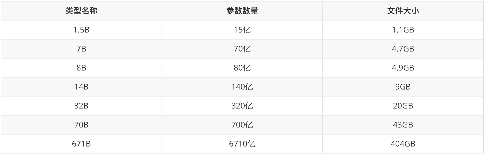
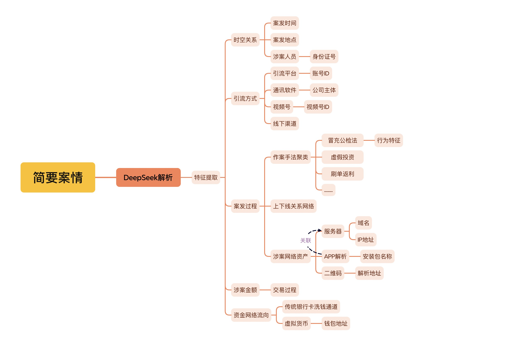

# 浅析新型网络犯罪DeepSeek AI实战应用

------

作者：风起

时间：2025年3月3日

## 前言

近期，DeepSeek AI大模型引起了社会的广泛关注，目前各行各业都在研究AI大模型在各自业务场景中的实战应用方案，**本文中笔者想要和大家探索的是DeepSeek AI在打击新型网络犯罪场景下的实战应用思考以及在具体业务中部署使用需要注意的局限性问题。**DeepSeek AI大模型凭借自身强大的数据处理能力和模式识别精度，能够有效挖掘海量数据中的隐藏信息，为公安人员提供及时、准确、全面的情报支持。其作为一项集成了深度学习、图像识别与自然语言处理等前沿技术的智能分析AI模型，在公安业务实战中的应用日益广泛，成为了提升警务效能、实现精准打击的关键工具。

本文仅代表笔者个人观点，如有不当，请指正。

## 知识导读

**首先，在正文讲解前，我们引入几点关于AI大模型的相关知识方便读者阅读理解后续的文章内容。**

DeepSeek作为一款国产自主研发的AI大模型，与目前市面上其他主流的AI大模型**（例如：文心一言、OpenAI）**不同的是，其对自身AI大模型进行了开源，这使得任何开发者可以根据开源协议免费使用Deepseek的开源模型进行本地化部署，极大的促进了AI行业的生态发展，降低了AI大模型的开发成本并且加速技术迭代的进程。

对于组织内部使用AI大模型，推荐本地化部署DeepSeek AI大模型，本地化部署不仅可以避免网络波动带来的影响，还能提供更高的隐私性保护和数据安全性。开发者在对DeepSeek进行本地化部署时，以**DeepSeek-R1**模型举例，其提供了多个版本以供下载使用，不同版本对于硬件设备的计算和存储需求都各不相同。开发者可以根据使用需求，选择合适的版本以此有效的节省成本，同时提升部署效率。

**DeepSeek-R1版本信息**

 

**1、相信看到这里大家可能会有疑问，上述版本中的B是什么意思？**

在AI模型中B代表数字**“billion”（十亿）**，1B等于10亿个参数，671B就表示6710亿个参数，这些模型的参数量越大，所能处理的数据和生成的内容就越复杂，但同时也需要更多的计算资源，更高性能的硬件来运行。每个版本相较于前一个版本的计算能力都有显著提升，尤其是从 70B 到 671B，模型计算能力大幅度提升，能够处理更复杂的上下文和细节问题。

**2、基础模型和671B的模型是什么关系呢？**

通俗来讲，就是残血版和满血版的区别，但是专业一点来讲，在机器学习中，模型蒸馏是一种优化技术，通过模仿教师模型的输出，训练一个较小的学生模型，从而实现知识的传递。教师模型通常具有较高的性能，但计算成本高昂，而学生模型则更加轻量级，推理速度更快，且内存占用更少。使用蒸馏版（残血版）的目的也就是**以更小的成本使用接近于高性能模型的功能**，但是假设在成本允许的情况下，满血版模型的性能一定是远远优于蒸馏后的模型的。举个例子，1.5B作为低性能的AI模型仅能用于简单的文档处理和语义分析，但是优点在于成本低廉，仅需使用一台家用计算机就可以快速部署，而671B一般用于商业或科研用途，也适用于对AI性能有较高需求的场景，但是部署成本较大，预估DeepSeek-R1-671B版本的部署成本大致范围可能在**200-300万元**之间。

**671B模型硬件需求如下：**

CPU：至少64核的高性能CPU，如AMD EPYC或Intel Xeon

显卡：NVIDIA A100或多个V100显卡，甚至需要集群支持

内存：至少512GB RAM

磁盘空间：至少2TB空闲空间

**3、多模态是什么？**

多模态指可以处理多种类型的数据，比如纯文字、图片、文档等，而单一模态的模型是指只能处理文字或图片或声音的模型。

**4、DeepSeek在中美博弈对抗态势的影响？**

想必大家都知道DeepSeek被美国攻击的事件，其中以美国英伟达市值暴跌2600亿美元举例，DeepSeek对技术路线的变革是冲击英伟达市场的主要问题，在以往AI行业的发展中，想要提升AI的性能，最简单快捷的方式就是堆硬件，以不断提升硬件性能来获得更高算力效率，这时AI行业对于高端显卡的需求是非常巨大的，可以说英伟达把控着AI行业的下层基础。但是这时DeepSeek通过技术路径创新，**以优化架构、算法的方式来降低对算力的需求，降低的算力需求可以达到近20倍**，这也使得未来通过优化算法架构来提升算力效率的方式成为发展趋势，另一方面也给国内芯片厂商**（寒武纪、华为昇腾）**间接提供了生机，国内AI行业也无需害怕国外制裁限制芯片出口中国大陆，所以看似是对DeepSeek的攻击，更是中美博弈对抗的表现之一。而且，正如上面所讲，**DeepSeek是开源的**，这使得未来AI行业发展，通过优化算法、架构提升算力或将成为主流趋势，对整个AI行业生态影响深远。

## AI大模型实战应用思考

**现在言归正传，首先我们应该思考，DeepSeek AI大模型对我们的工作能够有哪些帮助？**

笔者认为，根据用户的站位不同，其所能解决的问题是不同的，对于一些普通用户来讲，可能查阅资料，生成文档就已经占据了绝大多数的使用场景。但是，当用户使用场景具有明确的指向性，例如对于打击新型网络犯罪的一线办案人员来说，我们可以使用DeepSeek模型通过**自然语言处理（NLP）技术**对一些新发案件的案情进行快速解析，实际上就是帮助办案人员快速锁定并提取一些关键要素，帮助办案人员快速判断涉案线索查证维度，将非结构化的基本案情线索展开分析，从而降低了办案过程中对于侦查的一定门槛，大大提高了办案效率。

 

**案情解析概述图**

**1、类案、串并案关联分析**

对于目前打击网络犯罪的一个工作重点类案打击，办案人员可以快速对某一类案件进行聚合归类，再进一步来看，可以通过训练AI大模型实现对于疑似串并案进行线索关联，关键的技术点就在于需要办案人员**“指导”**AI模型如何进行关联，传授方法，例如在冒充公检法类诈骗的案件中，我们可以通过分析**APK包的名称、诈骗话术、冒充的公安姓名、电话号码、通讯软件账号、远程控制软件服务ID等**不同方面进行初步关联，后续办案人员可以根据AI输出的数据进行二次校验，大大简化了工作负担。目前，大部分AI模型均支持多模态，这使得在具体工作中对于一些复杂格式的数据源的处理更加便捷。

**2、AI智能分析海量监控数据**

在传统的办案侦查中，监控视频比对是一个很耗时且繁杂的工作，办案人员需要在大量监控视频中寻找关键人物，这也是笔者近期工作中遇到的痛点问题。DeepSeek AI大模型支持多模态分析，对视频流进行实时帧提取以及目标检测（如**人脸、车辆、行为识别**），结合时空信息构建索引库。办案人员可以输入模糊查询条件例如**衣着、行为、外貌特征**等信息使AI模型通过跨模态检索在千万级数据中秒级定位目标，减少传统侦查人工查找成本，目前在某地市交通部门已有应用AI在交通道路监控异常情况快速识别工作的案例。

**3、地区案发态势分析**

如果着眼于某地区新型网络犯罪案发的整体形势来看的话，AI大模型所能发挥的效力就非常大了。事实上，这项工作的基础是需要给AI模型不断投喂大量案情数据，当AI模型在训练的过程中掌握某地区一年内全量的案发状况，通过数据清洗和整合，构建全面、准确的地区案发数据集， 那么某种程度上我们就能够掌握该地区的整体案发趋势是怎样的。例如：掌握地区电信网络诈骗各类型案件的占比情况，同比增长或减少情况、分析该地区引流方式占比及演变过程（**部分引流方式存在地域性**）、犯罪技术手段演变、推测未来地区案发趋势等。进一步基于DeepSeek AI大模型建立公安部门专用的AI知识库，后续可以考虑通过AI语音交互模块实现对话功能，实现更加智能化的警务办公的愿景，对于地区案发态势分析的工作当建立在大量数据的基础上，后续任务就是对数据整合并量化的工作了。

**4、提升反诈预警的精准度**

首先，可以基于DeepSeek AI大模型开发动态风险监测系统，利用AI模型结合通话内容语义分析、受害者画像（年龄、职业、交易习惯、行为特征等）及异常转账行为，为潜在受害人计算一个**风险评分**。对于高风险用户，如老年群体、学生、居家人员等容易成为诈骗目标的群体，可以通过AI推送**分级预警**诈骗防范信息。对高风险目标启动**分级干预**：短信提醒->AI语音劝阻->96110电话劝阻->民警上门劝阻，形成**闭环干预**，进一步降低诈骗案件的发生概率。预警宣防是反诈工作的重点，通过接入AI模型实现赋能该项工作，对于进一步降低辖区内诈骗案件发案数具有不可或缺的作用。

**5、非结构化笔录归档**

DeepSeek在处理非结构化的笔录方面具有显著的优势。非结构化笔录通常指没有固定格式、内容书写较为随意、包含大量自然语言文本的数据（**我觉得这说的不就是笔录吗^_^**）。尽管目前各地公安对于笔录的记录要求逐渐规范，笔录电子录入时需要将一些可能帮助后续破案的关键信息要素作为的必填项。但是，对于在统一规范之前的部分笔录在电子系统入库对接时，往往需要人工录入，有的笔录记录过于简单甚至缺失一些关键要素。这时，如果通过DeepSeek针对这类笔录进行处理，首先将已存在的关键要素录入系统，后续再人工介入补充这些缺失的部分，就可以大大提升案件系统人力管理成本。再进一步来看，可以通过AI对于笔录中记录的情形进行语义分析，办案人员可以通过描述情形使AI模型对一些较为久远的案件进行快速关联，相比传统关键词检索，召回率得到有效提升。

**6、地区出口流量AI智能监管**

关于地区出口流量接入AI模型进行监管的这部分内容，我认为首先应该把问题抛出来，这样的可行性是怎样的？接入后的利弊关系是怎样的？如何寻找一个平衡点？这些都是现实部署中会遇到的一些问题。当然了，如果地区未拿到运营商的流量口，后续的工作都无法开展，这也是工作的第一步，一般流量口都是以省级为单位，直辖市或者部分副省级城市可能会有。

首先回到第一个问题，**AI智能监管出口流量是否可行？**我认为是可行的，设想一下，假设我们想要在某地区的出口流量进行监管封控一些非法网站浏览，这样的网站包括但不限于涉诈、涉恐、涉黄等标签的站点。较为传统的方式就是以建立黑库的方式进行拦截，这样的方式存在一个弊端就是如何保证黑库的数据实时更新，如何保证数据更新的效率，以及一些历史为黑名单但是变更主体后为正常业务域名或IP如何判断。最大的问题就是不能影响正常业务的网络访问，需要把握好监管的分寸，如果接入AI模型后，可以通过智能分析网站的涉诈系数，这项工作目前已经有很多成熟的案例，我们只需要学习现成的方法手段即可。

第二个问题，**接入后的利弊关系是怎样的？**，我认为在条件宽松的情况下，接入的利应该是大于弊的，接入AI模型对于我们开展工作无疑帮助巨大，管控起对外流量，可以说对反诈预警管制工作具有重大帮助。举个通俗点的例子，当限制一个人无法走出自家门口时，线下接触式受伤的概率是不是就非常小了（当然概率不是为0），而如果该地区的潜在受害人无法访问到涉诈站点就被拦截并回显**“您正在访问涉诈站点”**，这样是否可以减少很多电信网络诈骗的发案数量呢？大道理小道理反映的问题都是一样的，通过AI模型对黑灰色网站进行分析标记的效率要远远大于传统黑库的更新效率。但是接入AI所应该考虑的弊端也是需要考虑的重点，我们如何保证AI识别的准确性，笔者认为关于准确度的问题应在不断训练中进行完善，理论上当本地化部署的AI模型通过不断训练业务知识，其工作适配度也会不断提高。

最后一个问题，**如何寻找一个平衡点？**我们应在采取措施之前，寻找一个平衡点，即如何在不影响业务的情况下去接入一个新鲜的事物，首先，应该让AI模型介入流量分析工作但不执行操作，在一定周期内持续观测黑灰网站识别的精准程度，不断以并行流量的方式投喂流量数据提高精准度（并行就是流量仅经过AI模型但不影响流量的正常通行），当精准度达到我们的预期时就可以逐步介入封控工作，尽可能的将接入可能导致的弊端风险减少，选择较为保守温和的方式开展这项工作，把握好封控的强度，接入后不能直接加入具体封控工作。这也是我们讲为什么要寻找一个平衡点，在AI模型接入的利处和弊端之间做取舍，使两者之间达到一个平衡，既能满足我们的业务需求又能在实际工作中稳定、高效的运行，为未来的工作开展提供助力。

限于文字篇幅，这里我们就不展开论述了，实际上地区出口流量AI智能监管在实际业务部署时应考虑的情况远不止上述三点，想要在实战中应用还是需要组织专家团队座谈展开论证，具体问题具体分析，将业务需求与技术实现落地结合。有些时候思路构想是不错的，但是落地到实际工作中还是会存在各种各样的问题，存在一定的偏差，需要我们在不断碰撞中探索解决方案。

## 公安业务部署的局限性

上文分析了DeepSeek AI大模型在打击新型网络犯罪场景下的实战应用思考，那么本章节我们不谈优点只讲困难。我始终认为如果任何新兴事物的落地都需要考虑各种实际问题，都一定会存在某些局限性，有些局限是显而易见的，有些局限却是潜在的，可能是客观存在的，但是我们以往不曾想到的实际问题，这些问题在落地时都应考虑到，将这些问题想到，做到，避免以后潜在的问题造成一些重大影响。

**数据安全性是最大的问题**

我认为公安业务部署DeepSeek AI大模型的**最大局限性就是数据安全性的问题**，具体点来说就是公安数据必须只能只存在于内网中，而且在内网中也应考虑模型的选择，**尽量保持地区本地化部署**，目前全国各地公安均在陆续搭建专用的DeepSeek AI大模型。为什么这么做呢？从数据安全的角度考虑，AI大模型的核心就是对已存在的数据资料进行整合输出，如果我们持续投喂敏感数据的话会造成数据泄漏的问题。一点不夸张的说，**如果使用接入外网或者一些企业的接口会导致重要资料外泄**，其他人通过对AI模型的一些引导就有可能使这些敏感的数据吐出来，之前关于ChatGPT刚刚兴起时，国外曾报道过许多企业员工频繁使用AI进行数据分析，造成企业重要资产数据发生泄漏的案例。不仅仅只是数据资料，很多程序员习惯使用AI生成代码或对自己的代码进行优化，AI模型的代码生成很多是从网上的一些代码仓库中贴上去的，如果对代码不熟悉很有可能会存在一些bug、漏洞影响业务系统，对代码优化时如果直接把系统的代码复制给AI，那么重要代码就泄漏出去了，所以如果我们想要把DeepSeek AI大模型应用到公安业务中，一定要选择本地化部署DeepSeek物理隔离且进行网络隔离。

**侦查思路依然离不开经验**

笔者认为，以目前AI大模型的实际性能，AI代替传统侦查的说法显然是不现实的。案件打击过程中，AI提供的侦查思路仍然只能仅供参考，很难真正意义上的完全取代传统侦查员进行实战工作，因为AI在复杂业务工作中需要深度逻辑推理的问题中，不具有处理经验以及方法，无法应对并决策一些特殊情况，例如传统的分析数据无法应对新型作案手法，需要依靠在实战中对模型不断训练。起码在目前的新型网络犯罪博弈过程中，**AI是无法取代传统侦查员的工作的**，这也是一句盖棺定论，未来是否会取代笔者无法预测。对于当下新型网络犯罪博弈态势中，传统侦查思路仍然占据主导地位，但是未来的发展趋势一定是**技术与侦察思路相互结合才是破局的关键**，我们仍然需要不断探究技术创新与传统的方式相互结合，只有这样才能在未来的打击网络犯罪的过程中占据上风。

**明确AI应用的主导关系**

AI模型始终是辅助于我们开展业务工作的。正如上文所提，当用户的站位不同，需要思考的问题是不同的。对于AI模型的接入无疑是对公安业务工作未来发展的巨大辅助，但是一些重要的工作仍然需要以人工占主体，对于一些无法判断其真实性的数据和结论，一律抱有否认的态度看待，AI模型的数据准确性始终是目前的大问题，一些结论性的东西宁可没有也不能是错误的。相信大家都深有体会一种情形，当AI模型输出一段资料时，其中存在显而易见的错误时，用户提出质疑，AI模型会马上更正错误回答，尤其是对于一些复杂且高度依赖于经验的业务情形中，这样的情况更是频发，**所以明确AI与我们工作之间的关系是非常必要的**。

相信通过上面提到的一些局限性大家也能有所思考，对于AI模型应用到实际工作中这些都是需要必要考虑的环节，当然这也是浮于表面的问题，由于本文仅作科普就不进行深入讨论了，仅进行抛砖引玉。无疑AI模型应用在打击新型网络犯罪业务的优点非常大，但是其短板也是客观存在的，我们需要正视这些问题可能导致的后续影响，寻找方案去解决它，真正的将AI转换为工作的重要助力。

 

## 后记

文章到了这里已经接近尾声，感谢各位读者的耐心阅读，也希望通过本文能够对大家未来的工作能够有所帮助，之所以创作本文也是近期在工作中领导提出需要对DeepSeek AI大模型在实战业务的应用作为重点课题研究，于是我就花了一段时间进行构思，查阅资料，探讨业务需求，最终就有了本文，其实就是将自己的思路以文字的形式记录下来。有些时候可能让我讲一些关键的地方当场没有想到，但是以文字的形式就可以尽可能全面的写下来，但是不排除仍然有没想到的地方，欢迎大家提供思路，并指正问题。

我平常也比较喜欢尝试将一些实战中的经验论转换并落地从而赋能后续的工作，但是很多技术研究对于基层办案单位来讲应用场景并不多。所以，贴合实际需求也是我想表达的意思，将本职工作**做精，做细，做实**的前提下，总结技战法，开发工具落地解决实战中的痛点问题是我目前的的工作重心。本文想要告诉大家的是，在关注新兴事物带来的正向价值的同时，也要关注其负面影响即局限性的问题，是否确切的贴合自身业务需求，以辩证的思维看待AI对于我们工作所带来的影响。限于篇幅，其实还有很多想要表达的地方没有写下来，纸短情长哈哈哈，欢迎大家来一起交流分享。

**最后，祝大家心想事成，美梦成真！临近毕业，也祝自己，得偿所愿！**

