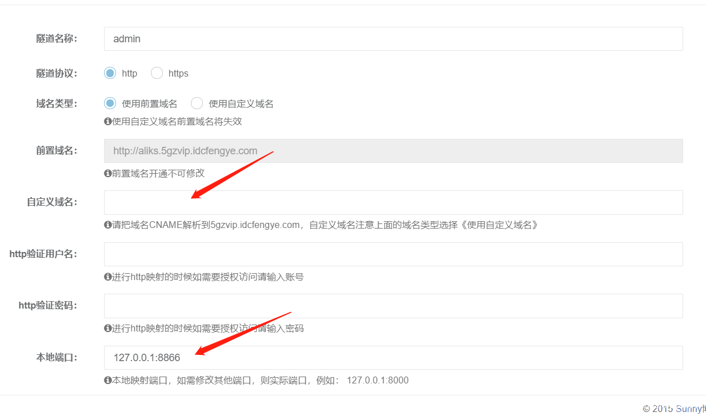
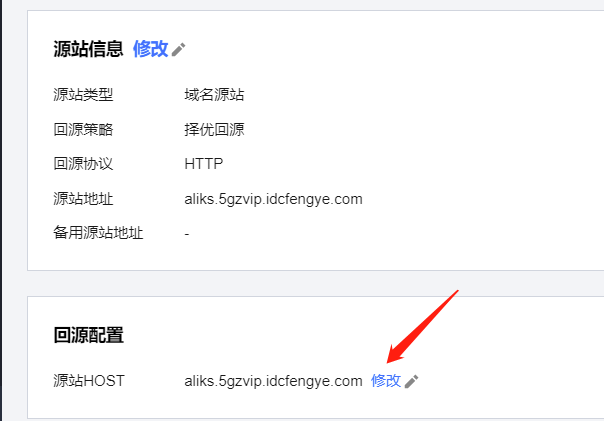
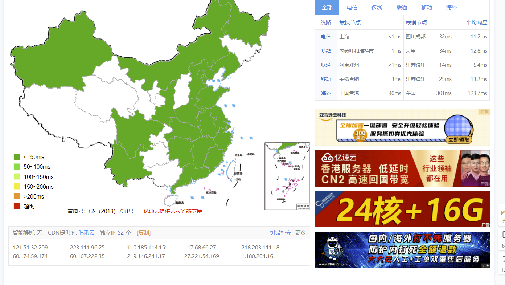
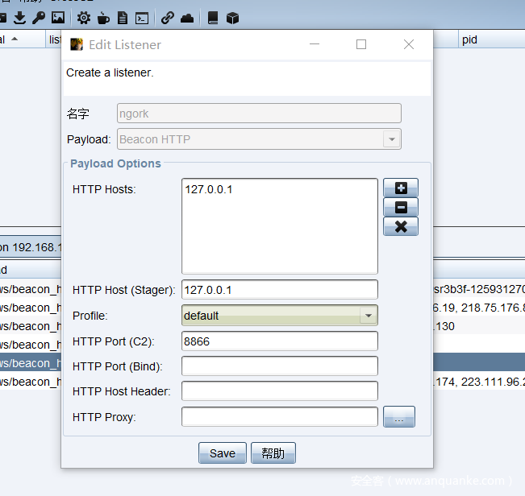
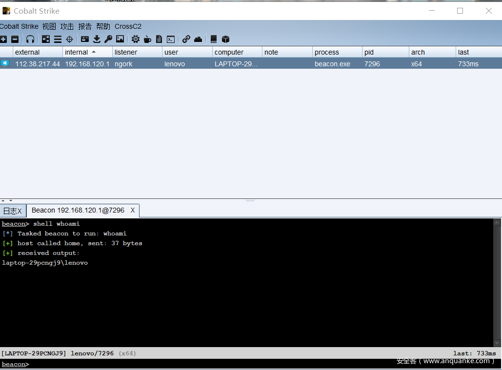
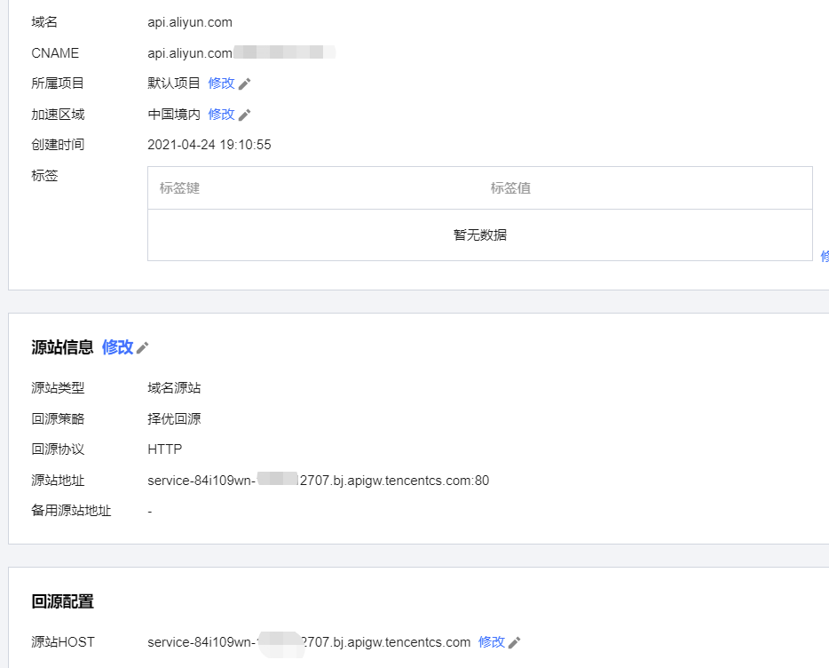
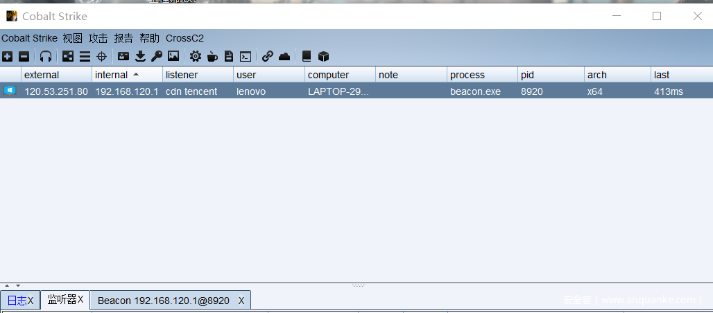
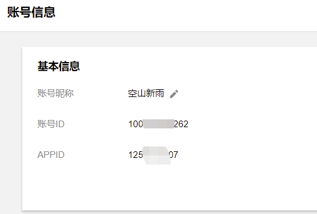
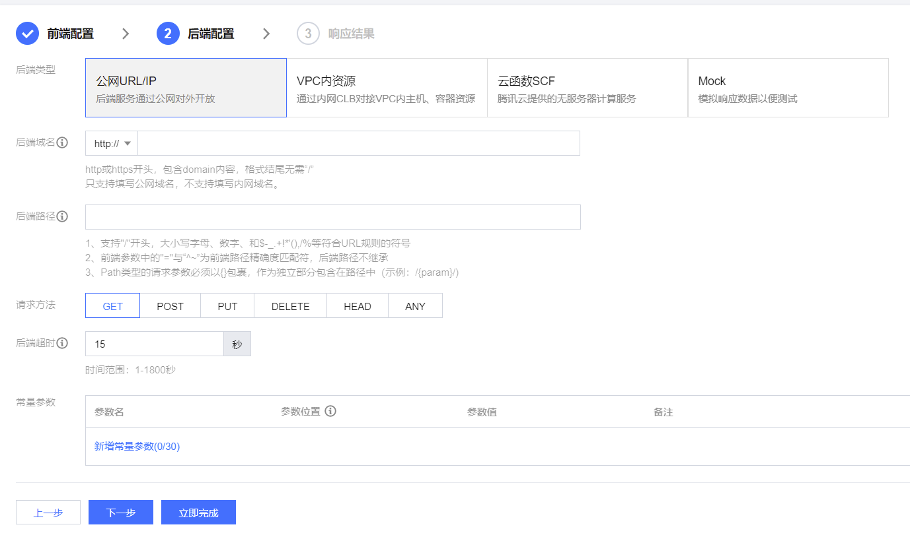

# 红队攻防基础建设—神隐之路

## 前记

本次主要写一下之前<红队攻防基础建设—C2 IP隐匿技术>一文中关于隐匿的一些进阶用法和本人的一些猜想实验，本文大概也是关于C2隐匿这个主题的最终章，在准备写文章前也和微步的Anakin、师傅聊了很多，收获颇丰，感谢他：）。在我们去做之前提到的一些隐匿手段时，是否会去想这个手段的一些缺陷和溯源方法？本文也会写到作者对一些隐匿手段溯源的猜想，或许有考虑不周到的地方，各位师傅可以多多提出意见。

 

## 域前置&Nginx反向代理

在看到上面的标题时，也许会有许多读者有着这样的疑惑。域前置不是被阿里云做了限制不能使用了吗？那么俗话说的好，路不止一条，通过使用其他厂商(部分)的CDN服务，也可以实现梅开二度的效果。这次就不公开说明本文使用的CDN厂商信息，小伙伴们可以通过本文自行发现，那么开始言归正传。

### 操作步骤

首先域前置的配置这里不再赘述。这里Nginx反向代理我们以ngrok为例，开通一个隧道，进行配置，将本地端口设置为127.0.0.1:8866这里端口随意，因为最后CS会监听该端口进行上线。

设置完本地端口后，在我们的VPS服务器上，开启Nginx反向代理，如下图：

配置完代理后，通过访问aliks.5gzvip.idcfengye.com 这个地址即可代理到我们VPS的8866端口。

回源地址设置为上述的代理的地址，这里需要注意，回源地址的源码HOST一定记得配置(其他厂商同理)，否则无法上线。

接下来就与域前置相同利用方式了，全网ping一下负载IP。

随便找两个负载IP在CS监听一下即可。
重点来了。。我们还需要在CS监听一下Nginx代理到的那个端口

这里一定要设置IP为回环地址或者内网IP，如果直接设置为我们VPS的公网IP，那么受害机的流量是会出现跟我们VPS之间的通信的。

然后我们正常使用域前置的那个监听器生成一个木马。

成功上线

表面看起来与之前域前置的特征相似，但是中间多了一层Nginx代理，这无疑给溯源工作造成了巨大的难度。因为本来域前置只是通过CDN技术从负载IP分发到真实VPS地址，但是中间多了一层反向代理，又进行了一次跳转，最后代理到我们的真实地址。

当然对于上述的Nginx反向代理其实还有一种方法，就是可以看到另一个箭头指向为自定义域名，我们可以通过修改该处，使用一个匿名域名，正常设置CDN加速，然后在ngrok配置即可实现与域前置效果差不多的CDN隐匿，区别只是HOST而已，但是无疑更加快捷，没有什么需要配置的。相较于域前置的配置步骤，这也是不错的办法，而且ngrok的稳定性我认为还是不错的。

### **二层隐匿溯源链的思考：**

第一层
如何突破CDN技术，获取到真实IP，因为域前置技术与我们以往认知的突破CDN不同，HOST头完全是任意域名，通信的IP地址为负载IP，无迹可查。

第二层
假设突破了域前置技术，获得了服务商的协助，但是CDN加速指向的域名地址为Nginx反向代理地址，且仅判断域名无法确认是哪家提供的反代服务。

第三层
假设溯源得知了提供服务的是Ngrok，并且维护人员愿意提供帮助，但是作为反代服务，因为Ngrok等多数的反代提供商都是匿名注册，并且在我们没有进行反代连接时，在服务器上也并不能看到我们的真实IP，但是当然可以得到我们反连的端口，这里就可以密切关注该端口，也不是不可以。

第四层
事实上，在反代这一层就有一个悖论，就是并不一定就是Ngrok，我们可以用任意的反代提供商比如heroku之类的国外的，也可以是我们用肉鸡搭建的，这样都是无从发现的，即使有各方面的支持来进行溯源也是困难重重。

### 溯源思路

那么继续来讲一下大家最感兴趣的域前置溯源思路吧，当然时至今日这种方式仍然没有很好的溯源办法，所以说到的仅是我个人以及与朋友交流得出的一些想法。

1、对于不同负载IP对应哪家CDN厂商做收集进行整合
2、当然他提出了主流大厂进行验证域名归属，小厂进行标记，我觉得这也是一种办法但是无疑是一件巨大的工作量
3、这里我提出了一种建议就是，遵从第一条所说的，如果能得知其使用的CDN厂商那么，结合HOST头，我们完全可以推导出他的CNAME值，毕竟同一个CDN服务商中加速域名是唯一，并且在域前置的实施方案中，CNAME已经可以指向真实IP进行通信了。所以在服务商的帮助下是完全有可能找到真实IP的，当然我们上面提到的二层隐匿无疑是给这种溯源猜想制造了另一难题。

 

## 域前置&云函数

在之前的文章里，这两种方式是分开讲解的，并讲述了各自的优缺点，但是两者结合起来又如何呢？下面我们来看一下吧！

### 操作步骤

首先正常配置域前置，与上述配置反向代理的方法一样，注意回源配置即可，这里域名地址配置为我们云函数触发的API网关地址。

云函数的配置这里就不多赘述了
直接与上述相同方法进行配置监听,因为原理也是通过域前置分发到API网关进行触发然后通过云函数进行转发到真实VPS。

上线成功
这里也是只能抓到CDN的负载IP。

### 溯源思路

其实原理很简单，与上面那个方法几乎是一样的操作。对于云函数的溯源思路其实很简单，在我们获取到的云函数域名地址中，相信大家会发现地址如下:
**service-o9sr3b3f-1259xxxx07.bj.apigw.tencentcs.com**
其中1259xxxx07，是我们腾讯云账号的APPID，这个ID是唯一的。如果获得腾讯云的支持，那么完全是可以溯源到该账号个人信息的，与阿里云的OSS地址差不多的性质，都可以进行溯源。

哪怕域前置和云函数所结合，那么不可溯源的仍然是建立在域前置安全的基础上，但是上面也有提到，我认为域前置在以后是有可能会被溯源出来甚至禁止的，所以这也意味着想要通过API网关触发云函数也好公网转发也好，都不是不可查的，所以还是谨慎渗透吧。

### 一点小坑

不知道大家有没有碰到过，云函数正常上线但是执行命令没有回显的问题，这是因为云函数中进行编码，以及post包参数的问题。我们在做profile中进行设置即可，当然过一阵会有这么一篇文章进行详细讲解在不适用profile情况下仅修改云函数及API网关配置的方法，小伙伴可以多多关注，嘿嘿就不说是哪里发了。

除了云函数的方法，其实直接使用API网关的公网IP转发更简便，也确实可以上线成功，这个本文不在拓展了，大家可以自行研究。 

## 后记

本文总体不长，主要还是分享了一些思路，作为C2隐匿篇的最终章我认为还是有必要发出来的，总的来说对于隐匿的一些手段，具体选择哪一个还是要根据我们实际的应用环境来选择的。一些常规的SRC挖掘其实云函数或者域前置都可以，但是一些隐匿度要求较高的项目就可以使用上面提到的一些方法。其实理论上可以无限套，但是我认为两层就可以了，也许大家会发现哪怕二层隐匿配置也很简单。是的，我认为隐匿作为辅助渗透的方法越简单越好，毕竟技术是用来服务人使用时更加快捷有效的。
其实我一直很喜欢去写这样的后记，因为可以比较轻松的把自己的一些想法写下来表达给大家，这也是我很喜欢做的。
有时候结果并不圆满，我们需要做的是学会接受它，接受这样的不完美。这是嘉哥对我说的话，谢谢他~

  **希望通过本文能够对您有所帮助！祝各位读者前程似锦，心想事成！**
