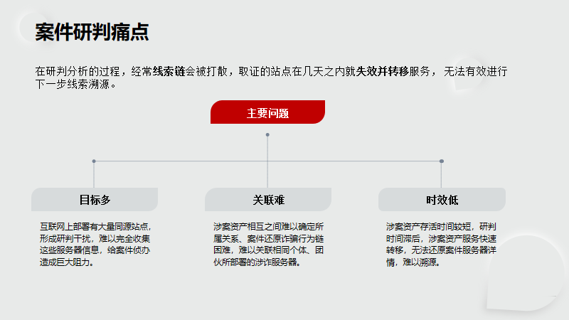
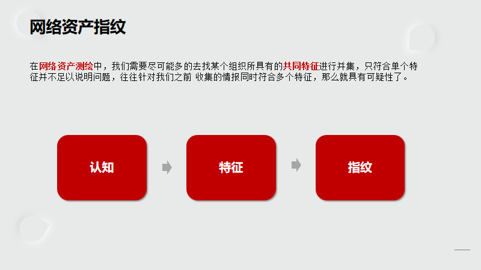
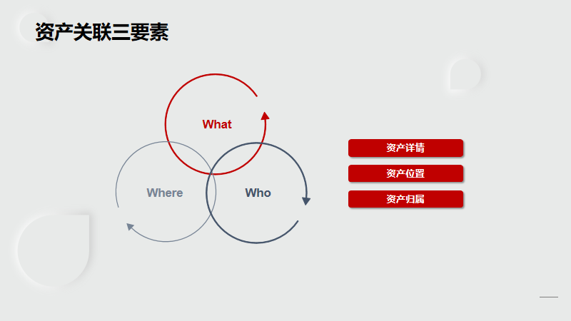
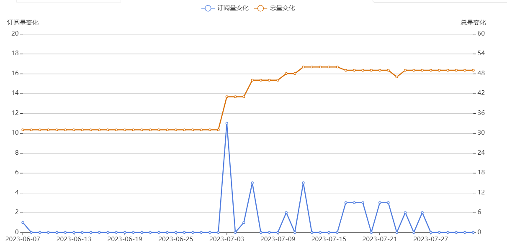
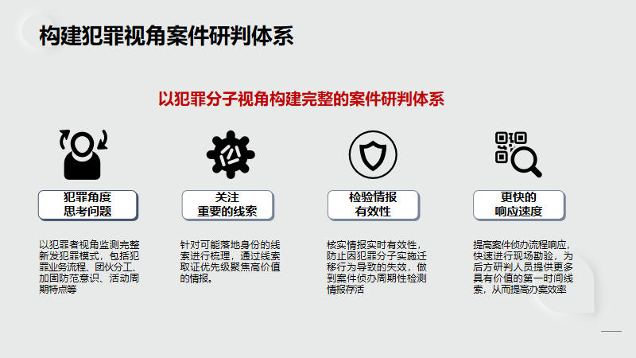

# 网络空间指纹：新型网络犯罪研判的关键路径

**作者：风起**

## 前言

新型网络犯罪是指利用计算机技术和互联网平台进行犯罪活动的一类犯罪行为。它涵盖了一系列使用网络和数字技术进行非法活动的行为，如**网络钓鱼、网络诈骗、恶意软件攻击、黑客入侵、数据泄露、网络色情和社交网络犯罪**等。

随着当前打击治理新型网络犯罪博弈态势逐步演进，案件研判过程即需要更加高效的治理手段。实现**科学研判、综合治理** 构建新型网络犯罪防治的全新体系，迫切需要加强警务人员研判手段，引进创新性研判技术，提高办案效率。从而实现新发案件侦办快速响应，针对网络犯罪案件治理**规范化、流程化**的举措。同时，由于新型网络犯罪的复杂性和跨国性，执法部门面临着案件研判滞后性的挑战，需要不断提升自身能力来应对这一威胁。

网络空间指纹是对涉案网络资产所表现的数字痕迹和服务特征的收集和分析，类似于传统刑事科学的指纹概念，每个网络犯罪活动站点都会在网络空间留下独特的特征。本文将重点介绍网络空间指纹的形成和采集方法，以及其在网络犯罪研判中的应用实践。同时，我们将通过实际案例分析，验证网络空间指纹在研判网络犯罪行为中的可行性和有效性。

## 刑事科学技术：行为与网络指纹概念

当前网络犯罪已发展为庞大的犯罪生态系统，新型网络犯罪为其他传统形式犯罪提供支持，加重了网络犯罪的危害。如何关联涉案组织团伙的网络资产成了案件侦办人员面临的一大难题。绝大多数情况下，由于犯罪团伙的服务器站点有着 **目标多**、**关联难**、**时效低** 等特点。在研判分析的过程，经常线索链会被打散，取证的站点在几天之内就失效并转移服务，无法有效进行下一步线索溯源。在当下打击新型网络犯罪的局势下刑事技术工作与网络进行结合是必要而迫切的任务，作为技术侦察部门必须首先提高网络技术业务能力，洞悉相关犯罪手段，协助刑侦、预审、起诉等部门做好新型网络犯罪案件的防范和打击工作。



**行为**：不同的群体，可能表现出基本的独有的特征，当我们能掌握到这个特征，那么我们就能尽可能识别出这个群体里的所有个体，而这些行为特征在网络空间测绘里表现出的是这个设备各个端口协议里的banner特征。

目前在网络空间测绘里常用的通用组件指纹识别形成的指纹库就是利用了通用组件默认配置特征这个**行为**来进行识别的，但是涉案相关的资产往往是进行自定义的配置的目标，而这些目标是本文要阐述的主要对象。在这些自定义过程中不同的群体又可能表现出不一样的独有特征，利用这些行为特征进行网络空间测绘，这就是所谓的“**行为测绘**”了。

**这里可以把行为理解为特征，而如何提取这些特征，进行更加精准的匹配无疑也成为了最重要的环节之一。**

在网络空间测绘中，指纹的概念与传统刑事侦查技术其广义思想是重叠的，例如我们在做人物画像的过程中，针对某个人的外貌体态进行描述，我们已知目标是大眼睛、高鼻梁、身材消瘦、身高等，这些是目标的外在特征，但是针对这样的特征是具有一定的模糊性的，因为站在整个社会的角度来看，同样符合上述特征的人比比皆是，但是这些依旧是侦察目标所具备的外在特点。所以继而我们要引入一些更加**“精准”**、**“特异”**、**“不可更改”**的个体特征，可以决定性的指向某个人或团伙的资产范围，既要精准的区分目标资产又要具有特异性，不可以被轻易修改的特点。

- **认知**
- **特征**
- **指纹**

针对网络资产指纹概念，提出以上三点，首先从认知出发，这里所说的认知也就是研判人员在分析时认为哪些特征是有用的，不同的人看待问题的方式、角度均是不同的，所以从认知出发看待事件本质，找出其符合我们所理解的**“精准”**、**“特异”**、**“不可更改”**的组成要素，进行组合，从而构建指纹。当然这里的特征通常并不会只有一个，哪怕是传统刑侦，面对目标手指纹也需要多个指纹进行比对，同样放在网络资产测绘中，我们需要尽可能多的去找某个组织所具有的共同特征进行并集，只符合单个特征并不足以说明问题，往往针对我们之前收集的情报同时符合多个特征，那么就具有可疑性了。



假设研判发现目标具有的共同特征为，**Nginx服务器、均为302跳转，时间相近，均为HTTPS协议**等，这是其目标资产所表现出的共同特征，能够间接印证我们关联的资产是准确的。准与不准的问题，往往就体现于此，就好比如果两张照片里的人没有丝毫相像，不具有相似的特点，那么它们之间大概率是没有交叉关系的。在溯源的过程中，情报并不是使用什么产品或者技术能够直接获得的，而是通过多个维度获得的线索相互印证、推导而来，所以在整个溯源体系中，研判人员对于技术的认知是至关重要的。这也是上面讲到的从认知角度出发，寻找目标特征，构建指纹从而高效研判这样的过程。

对于涉案站点资产数据的思考，其实更多的时候，我们想要梳理目标**组织架构**，**从属关系**，并且希望发现更多涉案网络资产，从中提取出能够用于下一步研判工作的数据，这才是网络指纹需要解决的核心问题。数据就在那里，它蕴含了很多的信息，至于能够从不同的数据中得到什么线索信息，也取决于研判分析人员对于数据的认知，溯源的过程也就是对数据聚合的过程，往往线索不是摆在那里的，而是经过缜密的分析以及情报线索之间的相互印证得到的，这也是考验溯源人员能力的关键所在。

随着目前打击网络犯罪进程的逐渐推进，犯罪团伙衍生出了诸多反侦察手段，服务逐渐迁移到国外云上，越来越多的站点服务开始通过云存储、云网关域名等去服务器化方式，通过二层跳转甚至更多层获取到真实的H5页面，而在APP中仅需要固定写入一个白名单的云网关地址即可避免多次打包以及真实H5地址被封禁的问题，这也说明通过APP落实服务器地址进行追踪的传统手段的难度逐渐增大。目前，针对这一现象，通过针对存活阶段的H5页面做出其专属的网络指纹可以实现有效的关联白名单域名后跳转的真实犯罪站点，为后续研判出真实服务器进行调整分析提供了关键路径。

## 网络空间测绘视角下的案件研判

网络空间测绘数据基于网络空间资产，是具备时间和空间属性的网络空间资产数据，基于网络空间资产，是具备时间和空间属性的网络空间资产数据。近年来，网络空间测绘技术已成为网络通信技术、网络空间安全、地理学等多学科交叉融合的前沿领域。**该领域主要关注网络空间信息的“全息地图”**，构建面向全球网络实时观测进行准确采样、映射和预测的强大基础设施，通过采用网络探测、采集、汇聚、分析、可视化等方式，将网络空间资源属性以及网络资源间的关联关系进行建模和表达，实现全球网络空间全要素全息数字化映射和可视化地图展现，以反映网络空间资源状态变化、网络行为。

全球网络资产数据采集一般依赖于较为专业的网络空间搜索引擎，通过部署全球化探针节点进行周期性的数据采集，并通过指纹规则进行分析、存储、建立相关的检索架构，以提供详细的信息检索数据。目前网络空间空间资产数据的获取主要依赖于如ZoomEye、Shodan、Censys和BinaryEdge等搜索引擎来完成。

**3W问题（“What？Where？Who？”）是涉网案件相关资产研判要解决的基本问题。**



3W问题从字面意思来看也就是**是什么，在那里，属于谁？** 而应用于涉网案件研判，目前一线侦办中对于涉案资产归属的划分较为严格，针对同类型高度相似的案件，是否为同一团伙，不同案件能够相互关联？都是需要思考以及确认的点，这种情况下，宁可能够获得的情报少一些，也要保证准确性。那么我们首先从who去思考再从what和where去信息收集，资产的所属以及相关的网络信息，例如使用的框架、部署的业务系统、服务、开放的端口、使用的开发语言、域名等等都是作为该团伙资产的共有模糊特征。当然，无论是从案件研判或者是企业安全运营的角度来看，首先确定的都应该是目标的归属问题，如果不是相关目标或者自己的资产时，那么后续的工作开展都是没有意义的，所以在进行空间测绘的使用时首先需要做的就是确定目标的归属问题，继而考虑资产所处的位置等问题。

对于新型网络犯罪的渗透工作，区别于常规的渗透任务，主要是针对该类站点的主要核心不在于找出尽可能多的安全隐患，更多的聚焦于 **虚拟身份** 这个概念。值得注意的是，为了落实虚拟身份，这里关注的数据更多时候着重于**代理身份**、**后台管理员身份**、**受害人信息**、**后台登录数据**、 **消费流水** 等信息。**总的来说，一切的数据采集都是为了更好的落实犯罪团伙人员的身份信息。**

在针对某一目标的关联中，如果目标站点使用了HTTPS协议，那么我们就可以通过提取证书 **Serial Number、Subject**等字段值进行关联资产，值得注意的是在SSL证书信息中，往往具有可以形成网络指纹特征的**特异、不可更改**的相关特征，例如可以查找CDN后的真实IP，或者在拿到了某个IP后证明其归属，识别其DNS服务器、相关域名等等。**在某场景案例中，例如我们找到了一个旁站资产并且仅有一个IP，这时如何证明其资产的归属，就不妨可以在证书信息中找找看，往往Subject字段中就有域名的相关线索，**或者像常见的SSL证书匹配方式将证书序列号进行HEX编码，通过搜索引擎的相关语法进行匹配的方式均可以。**常规提取的特征有favicon图标hash码，HTTPS证书序列号，前端代码段，服务连接banner等。**通过提取目标前端JS代码，这也是最为准确的方式，通过不同个体对于规则概念的理解，所编写指纹的匹配关联度、精准度都不同。

**下面列举实战案例场景下关联目标资产的案例。**

首先针对本地涉网IP：160.202.xxx.59进行网络探测，得到以下结果：

|       IP       | Port | Protocol | Service | ISP  | Country | City      | Title          | Time       |
| :------------: | ---- | -------- | ------- | ---- | ------- | --------- | -------------- | ---------- |
| 160.202.xxx.59 | 443  | https    | nginx   |      | China   | Hong Kong | 优惠大厅       | 2023-07-28 |
| 160.202.xxx.59 | 8888 | http     | nginx   |      | China   | Hong Kong | Redirecting... | 2023-07-01 |
| 160.202.xxx.59 | 888  | http     | nginx   |      | China   | Hong Kong | 403 Forbidden  | 2023-06-20 |
| 160.202.xxx.59 | 21   | ftp      |         |      | China   | Hong Kong |                | 2023-05-28 |
| 160.202.xxx.59 | 80   | http     | nginx   |      | China   | Hong Kong | 404 Not Found  | 2023-04-27 |

发现目标IP开放HTTPS 443端口，这时我们可以查看其TLS证书信息，寻找关联资产，因为TLS证书中的某些字段通常具有唯一指向性，所以可以以此获得较为准确的涉网关联资产。

```bash
SSL Certificate
Version: TLS 1.3
CipherSuit: TLS_AES_256_GCM_SHA384
Handshake Message: x509: cannot validate certificate for xxx.xxx.xxx.xxx because it doesn't contain any IP SANs
Certificate:
    Data:
        Version: 3 (0x2)
        Serial Number: 1270793655660676xxxx2163492096409332991 (0x5f9a9875af8df76858b6aa9a065fecff)
        .........
        DNS:61654tyj.cc, DNS:tyj6165.com, DNS:www.61652yh.com, DNS:www.yh61652.com, DNS:yh46165.com, DNS:46165tyj.com........
```

可以发现该HTTPS证书信息中**Subject和X509v3 Subject Alternative Name**字段存在域名信息，研判过程中这些域名信息均可以作为基础数据源来做下一步资产关联操作，从而达到拓展线索的目的。**进一步也可以将证书序列号HEX编码后作为指纹依据进行检索**，即以Serial Number字段作为指纹进行关联资产，原始序列号值的样式为：

```
5F:9A:98:75:AF:8D:F7:68:xx:xx:AA:9A:06:5F:EC:FF
```

HEX编码后得到网络指纹为`1270793655660676xxxx2163492096409332991`。通过序列号形成的指纹可以对大网数据中，使用了相同TLS证书的网络资产进行聚合关联，后续研判人员可以根据关联出的数据进一步判断资产归属，作为扩线的依据为落实出涉案人员虚拟身份提供更多线索基础。

通过研判人员根据目标特征所形成的网络指纹，可以针对已经关闭的服务器所部署的站点进行盘点，尽管这些站点因为案件时效性的问题已经关闭或转移服务，但是研判人员仍可以通过以往收录的测绘数据还原目标资产历史开放服务情况，从而**关联资产、还原涉案**资产情况。

```javascript
if (regx.test(actuser)) {
	layer.msg('会员账号不正确，不能输入特殊符号或者空格！', {
		icon: 2,
		time: 1000
	});
        return false;
}

$.ajax({
	url: '/addons/active/index/saveuser.html',
	type: 'post',
	data: {
		actuser: actuser,
		form: form,
		captcha: captcha,
		act_id: this.act_id ? this.act_id : act_id,
		token: 'bcbde5498bd1cf03474b80f950d5cb49',
	},
})
```

上图为涉案目标服务器资产的JS前端代码片段，这里提取 `url: '/addons/active/index/saveuser.html'` 作为指纹匹配，可以发现大部分资产为国内IDC服务器，IP归属地为香港，标题为优惠大厅，ISP为Shenzhen Katherine，中间件为nginx等相似特征。**大网测绘结果共计133条记录**，验证一下准确性，通过访问结果IP地址发现其前端页面中也存在同样的代码片段，并且与其他站点完全一致，因此可以判断该站与最初的站点为相同模板，并且部署的服务器特征高度相似。

|       IP        | Port | Protocol | Service |        ISP         |  Country  |   City    |         Title         |    Time    |
| :-------------: | :--: | :------: | :-----: | :----------------: | :-------: | :-------: | :-------------------: | :--------: |
| 154.55.xxx.152  | 443  |  https   |  nginx  | Shenzhen Katherine |   China   | Hong Kong |       优惠大厅        | 2023-07-28 |
|  154.55.xxx.69  | 443  |  https   |  nginx  | Shenzhen Katherine |   China   | Hong Kong |       优惠大厅        | 2023-07-28 |
| 160.202.xxx.59  |  80  |   http   |  nginx  | Shenzhen Katherine |   China   | Hong Kong | 301 Moved Permanently | 2023-07-28 |
| 18.141.xxx.185  |  80  |   http   |  nginx  |     Amazon.com     | Singapore | Singapore |       优惠大厅        | 2023-07-27 |
|  103.60.xxx.11  |  80  |   http   |  nginx  |                    |   China   | Hong Kong |      新葡京娱乐       | 2023-07-11 |
| 119.160.xxx.141 |  80  |   http   |  nginx  |                    |   China   | Hong Kong |   短信活动申请大厅    | 2023-07-05 |

继续在上述特征的基础上增加代码片段特征进行构建网络资产指纹，进而得到如下结果。

```bash
"/addons/active/index/saveuser.html" +"layer.msg('会员账号不正确，不能输入特殊符号或者空格！',"
```

|       IP       | Port | Protocol | Service |           ISP           |  Country  |   City    |         Title         |    Time    |
| :------------: | :--: | :------: | :-----: | :---------------------: | :-------: | :-------: | :-------------------: | :--------: |
| 160.202.xxx.59 |  80  |   http   |  nginx  |   Shenzhen Katherine    |   China   | Hong Kong | 301 Moved Permanently | 2023-07-28 |
| 18.141.xxx.185 |  80  |   http   |  nginx  |    Amazon.com, Inc.     | Singapore | Singapore |       优惠大厅        | 2023-07-27 |
| 43.239.xxx.186 |  80  |   http   |  nginx  |                         |   China   | Hong Kong | 澳门威尼斯人-优惠大厅 | 2023-07-05 |
| 180.178.xx.110 |  80  |   http   |  nginx  |                         |   China   | Hong Kong | 301 Moved Permanently | 2023-07-04 |
| 180.178.xx.218 |  80  |   http   |  nginx  |                         |   China   | Hong Kong | 301 Moved Permanently | 2023-07-04 |
| 180.215.xxx.47 | 8443 |  https   |  nginx  | BGP Consultancy Pte Ltd |   China   | Hong Kong |     完美优惠大厅      | 2023-07-04 |
| 180.215.xxx.8  | 8443 |  https   |  nginx  | BGP Consultancy Pte Ltd |   China   | Hong Kong |     完美优惠大厅      | 2023-07-04 |
| 180.215.xxx.71 | 8443 |  https   |  nginx  | BGP Consultancy Pte Ltd |   China   | Hong Kong |     完美优惠大厅      | 2023-07-02 |

**大网测绘结果共计94条记录**，通过上述举例我们可以得知，在构建指纹的过程中，基于提取特征作为条件的增加，相关资产需要符合的特征更多，这里截取了两段前端代码，发现在单特征的情况下数据结果为133条记录，多特征匹配结果则为94条，说明多条件匹配下的精准度会更高，更加符合我们对于关联资产匹配度的要求！这里不仅可以是前端代码之间组合，也可以使用banner信息，端口信息，ISP等信息组合，根据大家对该组织特征的理解编写指纹即可，都可以有效的关联起涉案站点，但是每个人基于自己的认知做出的指纹关联程度可能不尽相同，也是基于不同人员针对指纹的理解程度决定的，识别哪些是有价值的特征也就是构建指纹最重要的环节。**总之，对于数据的认知很重要**。

除了通过前端代码作为指纹的方式进行关联，也可以通过站点设置的favicon图标来作为关联指纹，这里以一个伪造政府网站的案例展开论述，目标使用了国徽样式的图标作为网站favicon图标，但是该图标经过涉网开发人员的修改，具有了唯一性，所以通过favicon图标并进行mmh3编码作为网络指纹可以精准的关联起全网所有使用该伪造图标的站点。

Favicon指纹：`iconhash:19675xxx9909`

|       IP       | Port | Protocol |       Service       |    ISP    |    Country    |    City     |           Title            |    Time    |
| :------------: | :--: | :------: | :-----------------: | :-------: | :-----------: | :---------: | :------------------------: | :--------: |
| 103.143.xx.243 | 443  |  https   |    Apache httpd     |           |     Japan     |    Tokyo    |       国家医疗保障局       | 2022-12-04 |
| 172.247.xx.145 |  80  |   http   |        nginx        | CNSERVERS | United States | Los Angeles |      保险监督管理系统      | 2022-10-20 |
| 103.147.xxx.78 | 443  |  https   | Microsoft IIS httpd |           |     China     |  Hong Kong  | 全国一体化在线政务服务平台 | 2022-07-20 |
| 103.149.xx.135 | 443  |  https   | Microsoft IIS httpd |           |     China     |  Hong Kong  | 全国一体化在线政务服务平台 | 2022-07-20 |
| 154.223.xxx.85 | 443  |  https   | Microsoft IIS httpd |           |     China     |  Hong Kong  |  统一企业执照信息管理系统  | 2022-07-19 |

通过favicon图标样式作为指纹的关联结果如上，共93条结果。从更新时间也不难看出，该团伙人员从较早就已经开始做这块业务。并且服务器多数在香港地区，IDC不是主流大厂的云服务器，较难提取服务器镜像，并且目标中间件服务均为  Microsoft IIS httpd，可以看出涉网资产的部署具有一定相似性，推断该伪造政府网站模板有维护团队为其批量**开发、维护**服务器。可以看到部分服务器还有使用HTTPS协议，那么我们就可以使用TLS证书作为网络指纹的方式进行匹配深度关联信息，**从而对该团伙伪造政府网站的相关服务器站点一网打尽。**

[^为了读者更加清晰看出涉案资产的关联性，上述测绘数据结果均为部分摘选。]: 

在案件侦办过程中为了实现持续监控涉网新增资产，可以使用网络指纹为基础实现动态测绘。**对于动态测绘的概念，简单理解就是数据订阅**，这里可以通过指纹订阅，周期性对某个资产面进行扫描，从而使我们能够动态掌握周期内新增涉案网络资产的情况。往往刑侦对弈比拼的就是信息收集，收集的线索面越多对于侦破案件就有着决定性的作用。而案件的研判往往是滞后的，如果能够预先通过动态测绘持续对目标团伙新上线的相关资产进行监控，那么也就掌握了主动权。动态测绘应用于反诈工作中，面对使用相同网站框架，仅改变网站内容并进行快速转移服务器的目标可以进行紧紧追踪，**动态测绘的核心基础就是网络指纹**，以此确定资产区间，进行周期性扫描，通过动态测绘观测到的一定时间周期内新增的网络资产，从而判断该团伙下一步准备实施犯罪的新增站点及其活动意图，还原整个案件诈骗行为的网络思维导图，**基于“动态测绘”的理念，可以针对低频测绘数据进行分析和解读，去提炼获取不同维度的更多知识。低频测绘数据，适合持续时间较长的事件和跨度时间较长的分析需求，**以此更好的为**预警、研判**工作提供情报基础，做到事先预防、事后响应的目的。



[^某案件通过网络指纹进行动态测绘，资产数量周期变化折线图]: 

## 基于网络指纹形成涉案资产测绘研判框架

基于对上述业务研判场景的论述，可以得出在整个线索采集流程中，最重要的是对数字线索的聚合，将具有追溯价值的线索进行数据可视化，从而能够清晰的分析涉案资产情况。从武器化的角度来看，很多大方向都是将一线经验论与技术研究相结合，这两者应该是相互依存的关系，针对打击黑灰产业务场景下要做的不仅仅是针对某一个案件，而是面对某一类网络犯罪模式能快速，有效的响应研判，把以往的经验沉淀转化并落地成高效的研判能力。



**面对当下案件研判的痛点问题，具体需求提出以下几点：**

- 针对涉案资产进行梳理及管理，关联涉案公众号、小程序、APP商城、同类资产、威胁情报等
- 7x24小时实时监控涉案服务器变化 — 数据订阅
- 生成涉案资产服务指纹，针对同类站点基于全网测绘数据进行合并关联，从而发现目标组织隐蔽、边缘涉案资产，从而提供线索突破口勘验案件。
- 识别目标资产性质，识别云资产、CDN资产，海外资产，路由器等
- 针对国内涉案公司组织架构及人员关系实现有效关联、方便研判人员对前期线索收集阶段工作的快速完成，从而为后续研判提供有效帮助。
- 高精定位涉案IP地址位置（企业专线类、数据中心类、家庭宽带类、移动网络类、其他类型），通过IP数据服务可进行情报分析及风险溯源。
- 快速漏洞响应更新0day/1day，从而高效实现涉案服务自动化渗透，为案件研判赋能，减少警务研判时间成本。
- 警务人员在平台针对某一案件进行协同研判，统一工作进度。
- 根据不同案件，提供数据可视化**《新型网络犯罪作战综合态势监管大屏》**，为研判人员、指挥人员提供更加清晰的案件侦办进度，为制定下一步作战策略提供助力。
- ...........

新型网络犯罪的产生有其自身特殊的时代背景，作为一种既特殊又常见的犯罪形式，它与传统的犯罪行为有着不同的特征。当前网络犯罪已发展为庞大的犯罪生态系统，新型网络犯罪为其他网络犯罪提供支持，加重了网络犯罪的危害。随着该类犯罪双方博弈态势逐步演进，案件研判过程即需要更加有效的治理手段，从而实现科学研判、综合治理 构建新型网络犯罪防治体系的愿景，只有针对目标资产及涉案数据进行多维度分析，提取有价值的数据，才能在激烈的打击网络犯罪对抗中占得先机，进一步扩大战果。而面对这样的形势公安队伍迫切需要加强警务人员研判手段，提高案件侦办效率，实现快速响应，网络犯罪案件治理规范化。

基于网络空间指纹形成的网络资产测绘研判框架应用于打击新型网络犯罪应该解决的主要问题，旨在将研判人员关注的具有溯源价值的线索进行聚合，可视化的展现到作战中台，对目标所属的不同数据之间建立联系，自动化实现案件研判过程中的基础信息收集，平衡对研判人员侦察能力要求、时间成本，为警务团队专业化建设提供有效助力，实现案件流程化、规范化的需求。

## 后记

本文对于网络空间指纹进行了深入探讨，通过分析网络指纹的形成及捕获涉案资产的案例，我们深刻认识到在当今打击网络犯罪的进程中，该类案件呈现出更加复杂和隐蔽的趋势，而刑侦研判人员需要利用传统刑侦思维与现代网络研判技术相互结合从而达到高效关联出涉案网络资产，以应对不断变化的威胁。

 **最后祝大家心想事成，美梦成真，想要交流学习的同学可以通过Wechat联系作者:。**


## 参考链接

https://mp.weixin.qq.com/s/fQatA5iyewqRBMWtpVjsRA

https://mp.weixin.qq.com/s/QTyfHbcnoMYoVUXhcbCYCw

https://www.anquanke.com/post/id/265148

https://paper.seebug.org/1741/

https://github.com/knownsec/Kunyu
